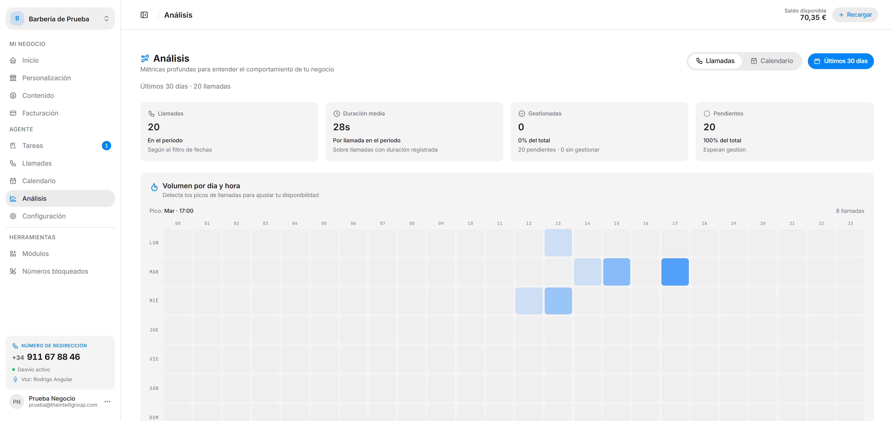
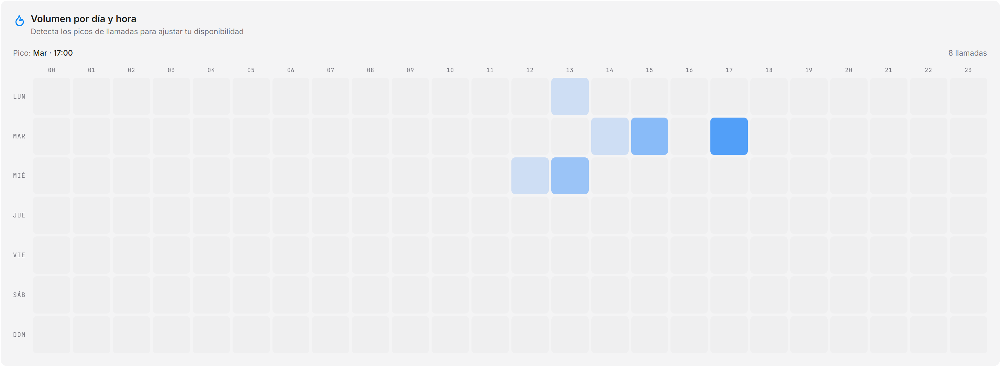
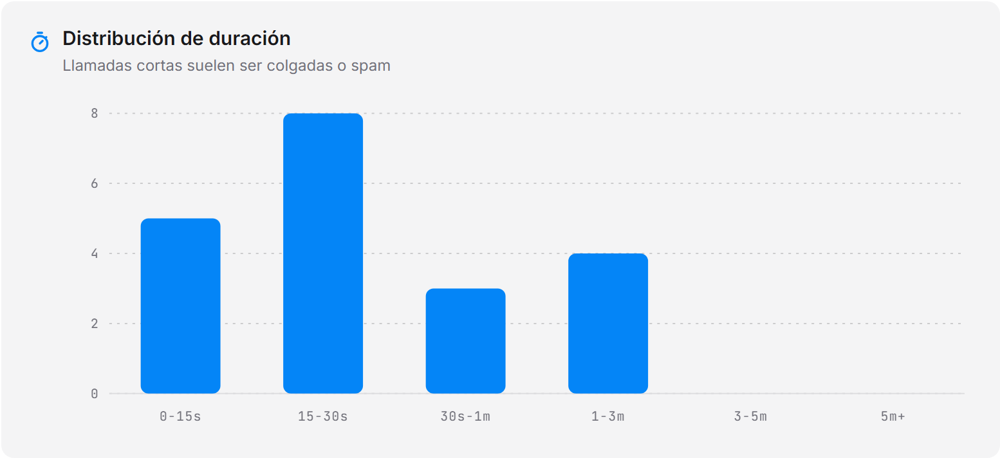
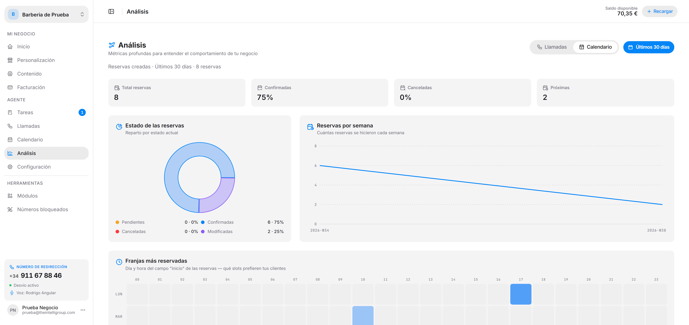

Métricas profundas para entender el comportamiento de tu negocio. Arriba a la derecha eliges entre los datos de **Llamadas** y los de **Calendario**, y el rango de fechas que se aplica a toda la pantalla.

---

## Tarjetas de cabecera

| Tarjeta | Qué te dice |
|---|---|
| **Llamadas** | Cuántas llamadas hay en el período seleccionado. |
| **Duración media** | Lo que dura de media cada llamada, sobre las que tienen duración registrada. |
| **Gestionadas** | Las que ya tienen estado *Gestionado*, con su porcentaje sobre el total. |
| **Pendientes** | Las que esperan gestión, con su porcentaje. |

---

## Volumen por día y hora

Un mapa de calor con los días de la semana en filas y las horas en columnas. Cuanto más intenso el color, más llamadas entraron en esa franja. Arriba a la derecha se indica el **pico** — el día y la hora con más volumen.

Sirve para ajustar tu disponibilidad: si el pico cae cuando estás cerrado, ahí tienes las llamadas que solo coge el agente.

---

## Distribución de duración

Un histograma que reparte las llamadas por tramos de duración: `0-15s`, `15-30s`, `30s-1m`, `1-3m`, `3-5m` y `5m+`.

:::note
Las llamadas muy cortas suelen ser cuelgues o spam. Si se te acumulan en el primer tramo y vienen del mismo número, puedes añadirlo a [Números bloqueados](/intellivoice/tools/blocklist).
:::

---

## Duración media por semana

La evolución del tiempo medio de llamada, semana a semana. Te dice si las conversaciones se están alargando o acortando con el tiempo.

---

## Análisis del calendario

La pestaña **Calendario** cambia las métricas a las de tus citas en vez de las llamadas, con el mismo filtro de fechas.

