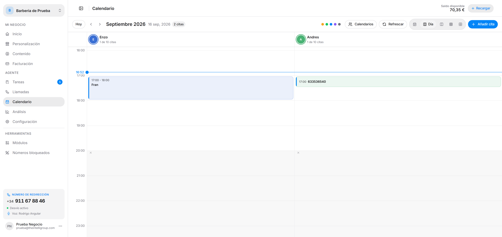
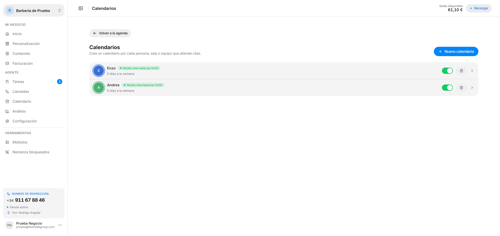
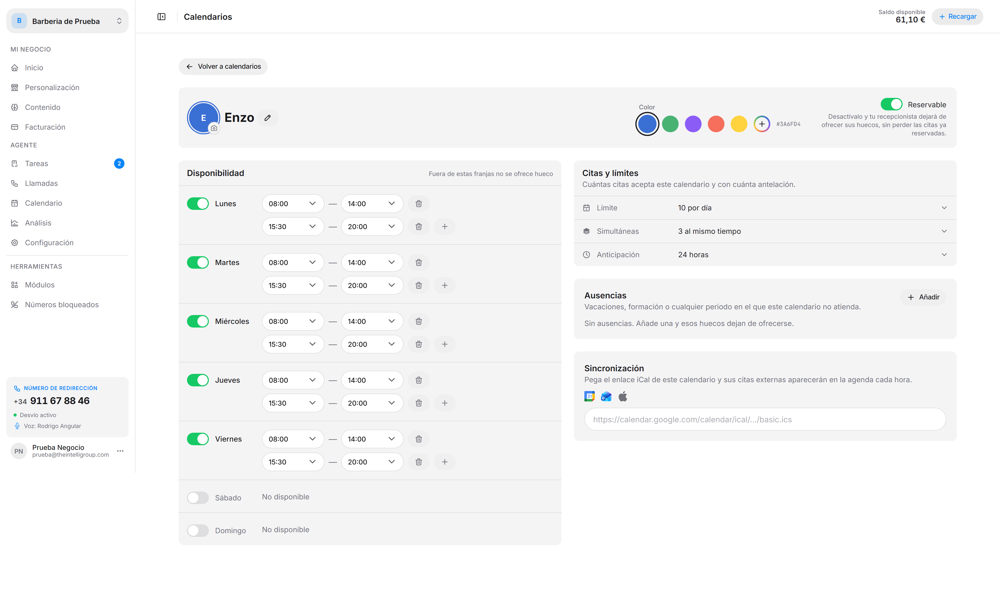

La agenda donde caen las citas que el agente agenda por teléfono, y donde puedes añadirlas tú a mano. Requiere el módulo **Calendario** activo — lo activas desde [Módulos](/intellivoice/tools/modules).

---

## Moverte por la agenda

En la barra superior tienes:

| Control | Para qué |
|---|---|
| **Hoy** | Vuelve al día actual. |
| **‹ ›** | Período anterior y siguiente. |
| **Mes y fecha** | El período que estás viendo, con el contador de citas. |
| **Viendo** | Filtra qué calendarios se muestran. |
| **Calendarios** | Abre la gestión de calendarios. |
| **Refrescar** | Recarga las citas al instante. |
| **Día / Semana / Mes / Año / Agenda** | Cambia la vista. |
| **+ Añadir cita** | Crea una cita a mano. |

Cada calendario es una columna con su color, su nombre y cuántas citas lleva sobre su límite diario (*1 de 10 citas*). Una línea marca la hora actual y las franjas fuera de su disponibilidad salen sombreadas. Para crear una cita rápida, pasa el cursor por un hueco libre y pulsa **Crear cita a las HH:MM**.

Las citas se pueden **arrastrar** a otra hora o a otro calendario; se te pide confirmación antes de moverlas.

---

## La cita

Al abrir una cita ves sus **datos**, el **servicio**, el **cliente** y los campos que el agente recogió. Si la cita nació de una llamada, el enlace **Ver conversación** te lleva a esa llamada.

Al elegir un **servicio** en una cita, la hora de fin se calcula sola sumando la duración que tenga ese servicio en [Contenido](/intellivoice/workspace/knowledge).

Cada cita tiene un estado:

| Estado | Qué significa |
|---|---|
| **Pendiente** | Agendada, aún sin confirmar. |
| **Confirmada** | Confirmada. |
| **Modificada** | Se cambió después de crearse. |
| **Cancelada** | Cancelada; se puede restaurar. |
| **Sincronizada** | Viene de un calendario externo por iCal. |

En la vista **Agenda** puedes mostrar también las **Pasadas** y las **Canceladas**.

---

## Calendarios

El botón **Calendarios** abre la lista: *crea un calendario por cada persona, sala o equipo que atienda citas*. No son solo personas — el propio campo sugiere *"Marta Ruiz, Sala 2, Ecógrafo…"*.

Cada fila muestra su avatar, su nombre y su estado actual — *Recibe citas hasta las HH:MM*, *Fuera de horario*, *Abre a las HH:MM*, *Ausente · motivo* o *No reservable* — además de los días que trabaja, la próxima ausencia y si tiene iCal conectado. El interruptor de la derecha lo activa o desactiva, y la papelera lo elimina.

:::caution
Al eliminar un calendario se borran su horario, sus ausencias y su enlace iCal, y no se puede deshacer. Sus **citas no se eliminan**: se quedan sin calendario.
:::

---

## Configurar un calendario

Pulsa sobre un calendario de la lista para abrir su pantalla. **Cada calendario tiene su propio horario y sus propios límites**: al crearlo hereda los de tu negocio, y a partir de ahí los ajustas aquí.

### Identidad

Nombre, color y foto. La foto es opcional: sin ella se usan las iniciales sobre el color.

:::caution
El nombre y el color no se pueden repetir dentro del mismo espacio de trabajo. El nombre es como tu recepcionista los distingue al agendar, así que dos calendarios con el mismo nombre la confundirían.
:::

### Reservable

Un interruptor. Desactivado, tu recepcionista deja de ofrecer sus huecos, **sin perder las citas ya reservadas**.

### Disponibilidad

Los días y franjas de este calendario, con una fila por día. Fuera de estas franjas no se ofrece hueco. Con **+** añades un segundo turno y con la papelera eliminas uno.

### Citas y límites

Cuántas citas acepta **este** calendario:

| Ajuste | Qué define |
|---|---|
| **Límite** | Máximo de citas por día. |
| **Simultáneas** | Cuántas pueden coincidir a la misma hora. |
| **Anticipación** | Antelación mínima para reservar, en horas. |

Cada uno lleva un interruptor **Sin límite** por si no quieres poner tope.

### Ausencias

Vacaciones, formación o cualquier periodo en el que este calendario no atienda. Cada ausencia tiene motivo, fecha de inicio y fin, y la opción *Todo el día*. Mientras dura, esos huecos dejan de ofrecerse y el calendario aparece como *Ausente* en la lista.

### Sincronización (iCal)

Pega el enlace iCal del calendario — Google Calendar, Outlook o Apple — y sus citas externas aparecen en la agenda **cada hora**. El enlace debe empezar por `https://` o `webcal://`.

:::note
Los valores que hereda un calendario nuevo (horario y límites por defecto del negocio) se definen en [Configuración → Calendario](/intellivoice/agent/settings). Cambiarlos ahí no toca los calendarios que ya existen.
:::
