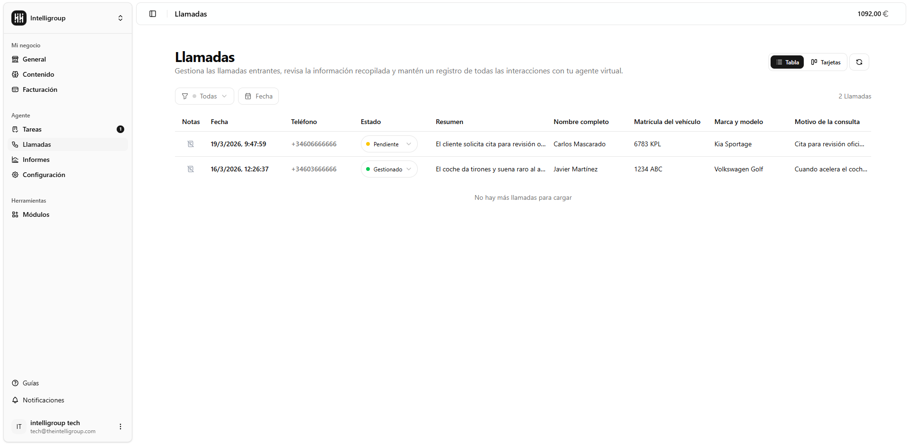
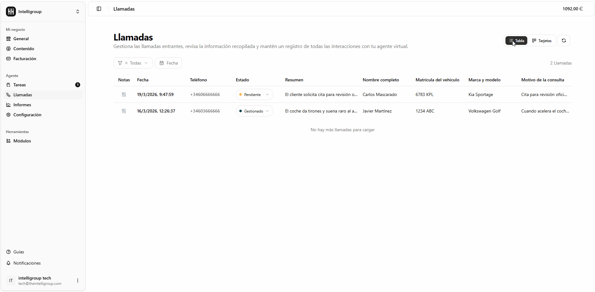
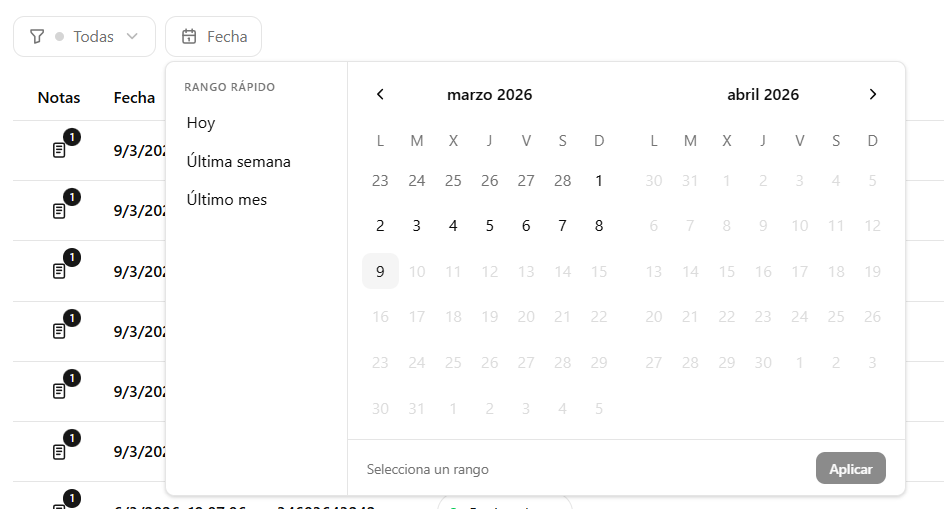
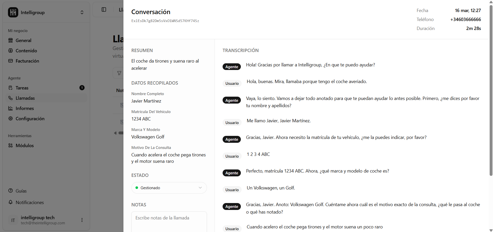
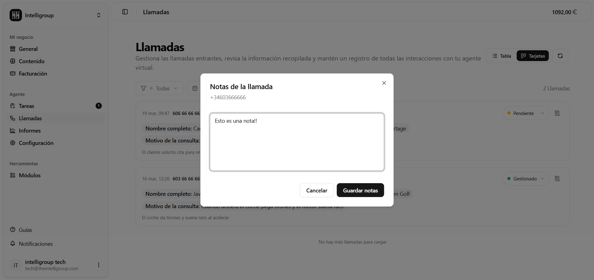

Gestiona todas las llamadas entrantes, revisa la información recopilada y mantén un registro de todas las interacciones con tu agente virtual.

---

## Vista de llamadas

Puedes elegir entre dos formas de visualizar el listado:
- **Vista Tabla** — filas con columnas: notas, fecha, teléfono, estado, resumen y los campos de datos configurados (nombre, matrícula, marca y modelo, motivo de consulta, etc.).
- **Vista Tarjetas** — cada llamada como una tarjeta individual con la información más relevante.
Cambia entre ambas vistas con los botones **Tabla / Tarjetas** en la esquina superior derecha.

---

## Filtros 

En la barra superior del listado encontrarás los siguientes controles:
| Control | Descripción |
|---|---|
| **Filtro de estado** | Muestra Todas, Sin estado, Pendientes o Gestionadas. |
| **Fecha** | Filtra las llamadas por rango de fechas. |
| **Contador** | A la derecha de los filtros, indica cuántas llamadas hay con los filtros aplicados. |

---

## Carga y refresco

- Si tienes muchas llamadas, baja hasta el final de la lista y se cargarán más automáticamente.
- La pantalla se actualiza automáticamente en segundo plano cada 30 segundos.
- Pulsa el icono de flechas circulares en la esquina superior derecha para refrescar al instante.

---

## Acciones por llamada

#### Ver el detalle

Haz clic en cualquier fila o tarjeta para abrir un panel lateral con:

- **Fecha y teléfono** del llamante.
- **Datos recopilados** durante la llamada.
- **Resumen** generado automáticamente por la IA.
- **Transcripción completa** — todo lo que se dijo, turno a turno, indicando si habló el **Agente** o el **Usuario**. 

#### Cambiar el estado

Cada llamada tiene un selector de estado con tres opciones. Puedes cambiarlo directamente desde la tabla o las tarjetas sin necesidad de abrir el detalle.

| Estado | Indicador |
|---|---|
| **Sin estado** | Punto gris |
| **Pendiente** | Punto amarillo |
| **Gestionado** | Punto verde |

#### Añadir o editar notas

Cada llamada tiene un botón de notas (icono de libreta). Al pulsarlo se abre un cuadro de texto libre para escribir notas internas. Si la llamada ya tiene notas, el icono aparece destacado.

---