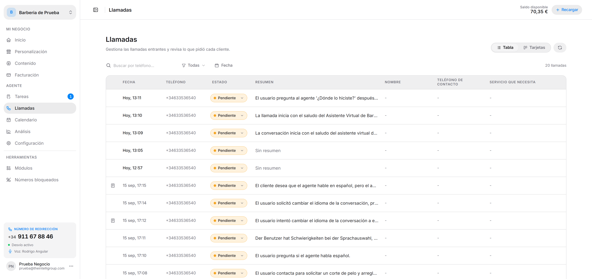
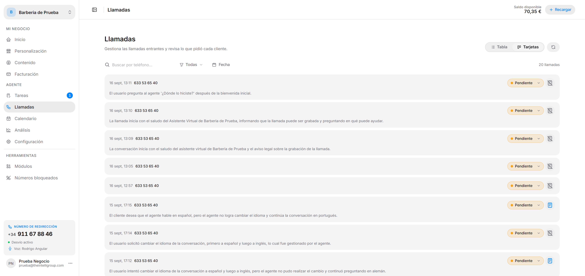
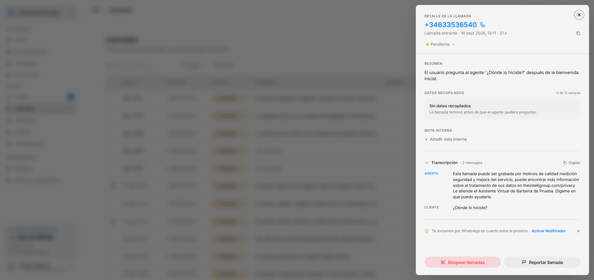
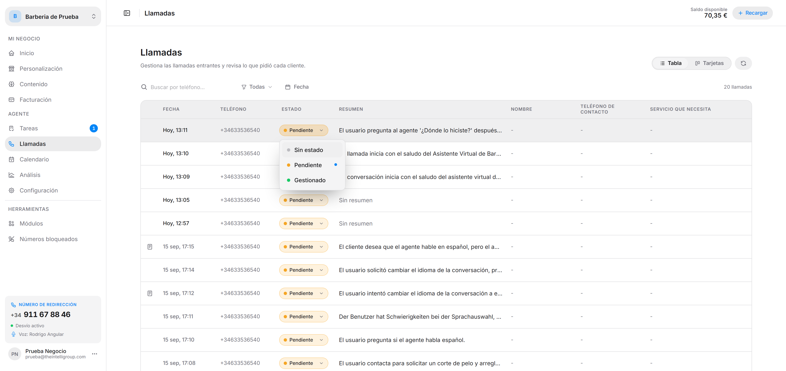

Gestiona las llamadas entrantes y revisa lo que pidió cada cliente.

---

## Tabla o tarjetas

Cambia la forma de ver el listado con los botones **Tabla / Tarjetas** de la esquina superior derecha:

- **Tabla** — una fila por llamada, con columnas de fecha, teléfono, estado, resumen y los campos que hayas configurado que recoja el agente (nombre, teléfono de contacto, servicio que necesita…).
- **Tarjetas** — cada llamada en su propia tarjeta, cómodo cuando recoges pocos datos por llamada.

---

## Buscar y filtrar

| Control | Descripción |
|---|---|
| **Buscar por teléfono** | Campo de búsqueda para encontrar todas las llamadas de un número. |
| **Filtro de estado** | Todas, Sin estado, Pendientes o Gestionadas. |
| **Fecha** | Filtra por rango de fechas. |
| **Contador** | A la derecha, cuántas llamadas hay con los filtros aplicados. |

---

## Carga y refresco

- Si tienes muchas llamadas, baja hasta el final de la lista y se cargan más solas.
- La pantalla se refresca sola en segundo plano.
- El icono de flechas circulares de la esquina superior derecha la actualiza al instante.

---

## Detalle de la llamada

Haz clic en cualquier fila o tarjeta para abrir el panel lateral.

Contiene:

- **Teléfono**, tipo de llamada, fecha y **duración**.
- **Estado**, que puedes cambiar desde aquí mismo.
- **Resumen** generado automáticamente por la IA.
- **Datos recopilados**, con el contador de campos completados (*0 de 3 campos*). Si la llamada se cortó antes de que el agente pudiera preguntar, lo indica.
- **Nota interna** — enlace **+ Añadir nota interna** para escribir lo que necesites. Las llamadas que ya tienen nota se marcan con un icono en el listado.
- **Transcripción** completa, turno a turno, indicando si habló el **Agente** o el **Cliente**. Se puede plegar y copiar entera con el botón **Copiar**.

Al final del panel tienes dos acciones:

- **Bloquear llamadas** — añade ese número a [Números bloqueados](/intellivoice/tools/blocklist).
- **Reportar llamada** — nos avisa de que algo no fue bien en esa conversación.

---

## Cambiar el estado

Cada llamada tiene un selector de estado, disponible tanto en el listado como en el detalle. Al cambiarlo se guarda al momento.

| Estado | Indicador |
|---|---|
| **Sin estado** | Punto gris |
| **Pendiente** | Punto amarillo |
| **Gestionado** | Punto verde |

Las llamadas en **Pendiente** son las que aparecen en [Tareas](/intellivoice/agent/tasks).
