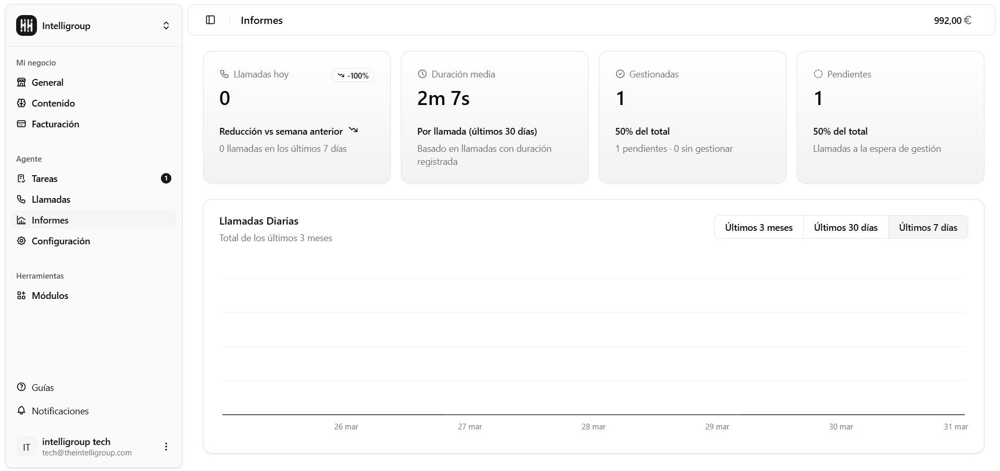
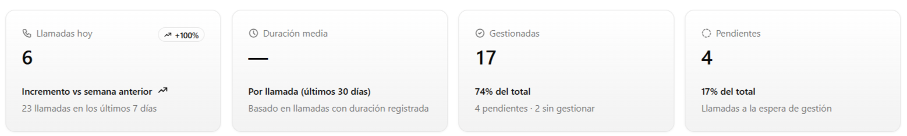
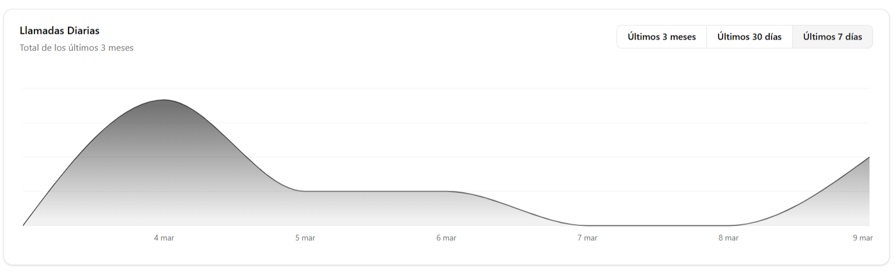

---

title: Informes

---

Es lo primero que ves al entrar al panel. De un vistazo tienes todo lo importante: *cuántas llamadas has recibido, cuánto duran de media y cómo va la gestión del día.*

---

## Estadísticas del día

En la parte superior encontrarás cuatro tarjetas con los números que más importan:

### Llamadas hoy

Cuántas llamadas has recibido hoy. También muestra si eso es más o menos que la semana pasada (con una flechita hacia arriba o hacia abajo) y el total acumulado de los últimos 7 días.

### Duración media

El tiempo promedio que dura cada llamada, calculado sobre los últimos 30 días. Se muestra en minutos y segundos.

### Gestionadas

Cuántas llamadas ya tienen el estado "Gestionado" (punto verde), con el porcentaje que representan sobre el total.

### Pendientes

Cuántas llamadas están esperando que les eches un vistazo (punto amarillo), con el porcentaje sobre el total.

---

## Llamadas diarias

Debajo de las tarjetas hay una gráfica que muestra cómo han ido llegando las llamadas día a día. Puedes elegir el período que quieras ver:

- **Últimos 7 días**
- **Últimos 30 días**
- **Últimos 3 meses**

Pasa el cursor por encima de cualquier punto para ver la fecha exacta y cuántas llamadas hubo ese día.

