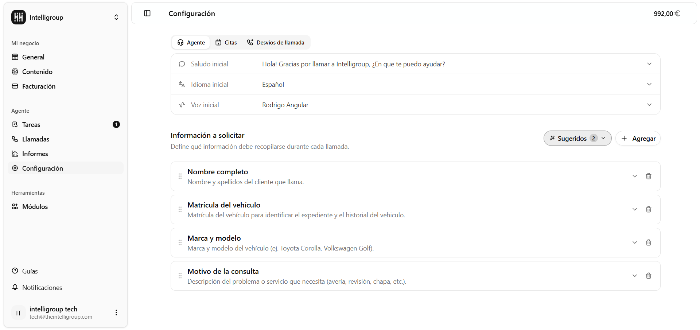
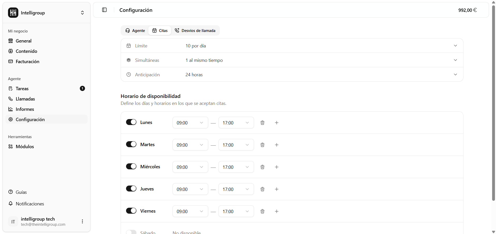
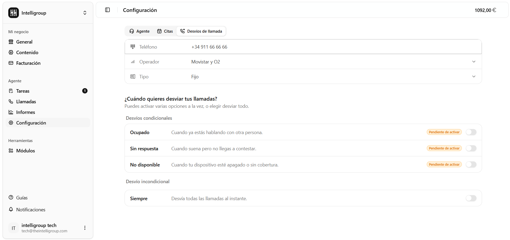

Aquí configuras el comportamiento del agente de voz, las citas y los desvíos de llamada. La pantalla se divide en tres pestañas: *Agente, Citas y Desvíos de llamada.*

---

## Agente

Define cómo se comporta el agente durante las llamadas

#### Saludo inicial

El primer mensaje que dirá el agente al contestar una llamada. Por ejemplo: "*¡Hola! Gracias por llamar a…, ¿en qué te puedo ayudar?*"

#### Idioma inicial

El idioma principal que usará el agente al contestar las llamadas.

#### Voz inicial

La voz con la que hablará el agente. Puedes elegir entre las voces disponibles en el desplegable.

#### Información a solicitar

Define qué datos debe recopilar el agente durante cada llamada. Cada campo tiene:
- **Nombre del campo** — el dato que se quiere obtener (ej: "*Nombre completo*", "*Matrícula del vehículo*").
- **Descripción del campo** — contexto adicional para que la IA entienda cómo pedir ese dato.
- **Sugerir con IA** — genera automáticamente una descripción sugerida a partir del nombre del campo.

Puedes gestionar los campos de la siguiente manera:

- **Agregar** — botón **+ Agregar** para añadir un campo nuevo.
- **Sugeridos** — accede a campos predefinidos recomendados para tu tipo de negocio.
- **Reordenar** — arrastra los campos con el icono de arrastre a la izquierda de cada uno.
- **Eliminar** — icono de papelera junto a cada campo.

:::caution
Los cambios en los campos solo afectan a las **llamadas nuevas**. Las llamadas anteriores conservan los datos que se recopilaron con la configuración activa en ese momento.
:::

---

## Citas

Configura cómo gestiona el agente las solicitudes de cita.

| Campo | Descripción |
|---|---|
| **Límite** | Número máximo de citas que se pueden agendar por día. |
| **Simultáneas** | Cuántas citas pueden coincidir a la misma hora. |
| **Anticipación** | Con cuántas horas de antelación mínima se puede reservar una cita. |

#### Horario de disponibilidad

Define en qué días y franjas horarias se pueden agendar citas. Hay una fila por cada día de la semana. Activa los días disponibles con el interruptor y configura la franja horaria correspondiente.

---

## Desvíos de llamada

Configura el desvío de llamadas desde esta misma pantalla, sin necesidad de marcar códigos en el teléfono manualmente.

#### Teléfono de entrada

Muestra el número asignado a tu espacio de trabajo, al que debes redirigir las llamadas de tu negocio.

#### Operador

Selecciona el operador de tu número de destino para que los desvíos funcionen correctamente. Opciones disponibles: Movistar y O2, Vodafone, Orange, Yoigo, Digi, Pepephone, Simyo, Lowi, MásMóvil.

#### Tipo

Indica el tipo de línea (móvil o fijo).

#### ¿Cuándo quieres desviar tus llamadas?

Puedes activar varias opciones a la vez o elegir desviar todo:

**Desvíos condicionales**

| Opción | Cuándo se activa |
|---|---|
| **Ocupado** | Cuando ya estás hablando con otra persona. |
| **Sin repuesta** | Cuando suena pero no llegas a contestar. |
| **No disponible** | Cuando tu dispositivo está apagado o sin cobertura. |

**Desvío incondicional**

| Opción | Cuándo se activa |
|---|---|
| **Siempre** | Desvía todas las llamadas al instante. |