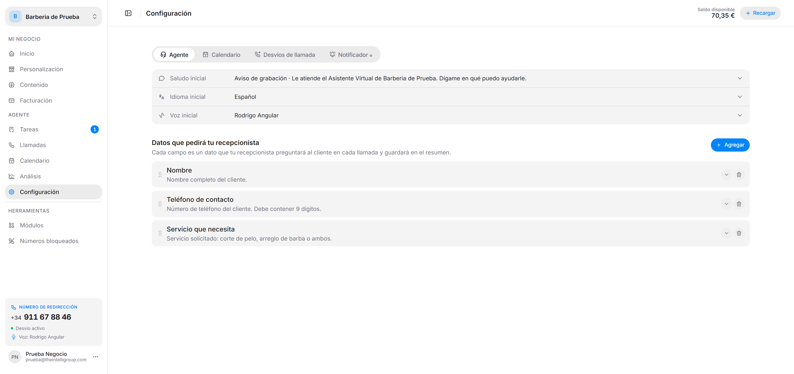
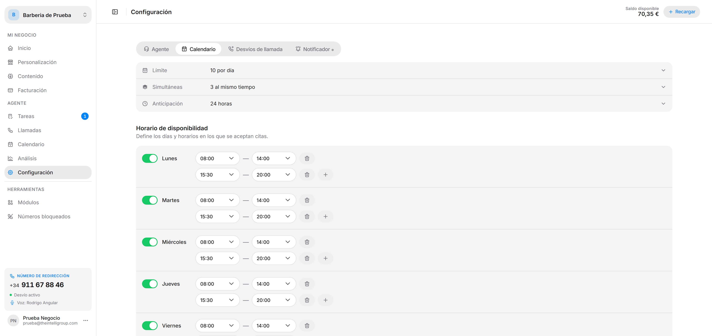
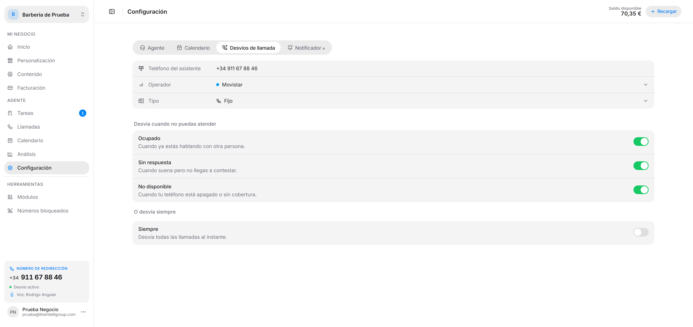
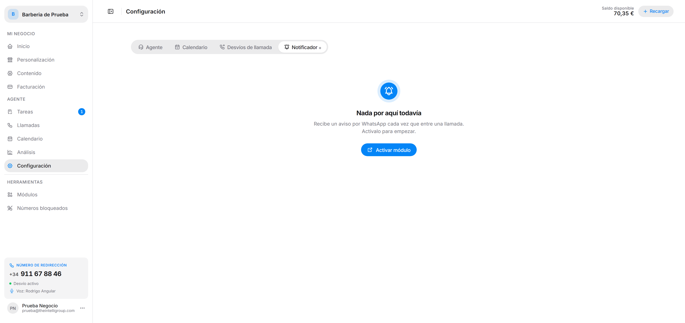

Aquí configuras el comportamiento del agente. La pantalla se divide en cuatro pestañas: **Agente**, **Calendario**, **Desvíos de llamada** y **Notificador**.

---

## Agente

Define cómo se comporta el agente durante las llamadas. Los tres primeros ajustes son filas plegables: pulsa una para abrirla y editarla.

| Ajuste | Qué define |
|---|---|
| **Saludo inicial** | El primer mensaje que dice el agente al contestar. |
| **Idioma inicial** | El idioma en el que arranca la conversación. |
| **Voz inicial** | La voz con la que habla, de entre las disponibles en el desplegable. |

:::caution
El saludo incluye siempre el **aviso de grabación** y la identificación como asistente virtual. Son obligatorios por el RGPD y el AI Act europeo: puedes mover dónde se dicen dentro del saludo, pero no quitarlos.
:::

### Datos que pedirá tu recepcionista

Cada campo es un dato que el agente preguntará al cliente y guardará en el resumen de la llamada. Cada uno tiene:

- **Nombre del campo** — el dato que quieres obtener (*Nombre*, *Teléfono de contacto*, *Servicio que necesita*).
- **Descripción** — contexto para que la IA entienda cómo pedirlo y qué formato espera.

Con el botón **+ Agregar** añades uno nuevo, el icono de arrastre a la izquierda los reordena y el de papelera los elimina.

:::caution
Los cambios en los campos solo afectan a las **llamadas nuevas**. Las anteriores conservan los datos que se recogieron con la configuración de entonces.
:::

---

## Calendario

Los valores **por defecto** de agendado del negocio. Requiere el módulo **Calendario** activo.

| Ajuste | Qué define |
|---|---|
| **Límite** | Máximo de citas por día. |
| **Simultáneas** | Cuántas pueden coincidir a la misma hora. |
| **Anticipación** | Antelación mínima para reservar, en horas. |

Cada uno lleva un interruptor **Sin límite** por si no quieres poner tope.

### Horario de disponibilidad

Los días y franjas en los que se aceptan citas, con una fila por día. Actívalos con el interruptor y define los turnos; con **+** añades un segundo turno y con la papelera eliminas uno.

:::caution
Esto **no** es la configuración de tus calendarios. Cada calendario tiene su propio horario y sus propios límites, en su ficha dentro de [Calendario → Calendarios](/intellivoice/agent/calendar). Lo de aquí es lo que hereda un calendario **al crearse**; cambiarlo después no toca los que ya existen.
:::

:::note
Este horario es solo para **citas** y es independiente del horario de atención del negocio, que se define en [Personalización](/intellivoice/workspace/general).
:::

---

## Desvíos de llamada

Configura el desvío desde aquí, sin marcar códigos en el teléfono.

| Ajuste | Qué define |
|---|---|
| **Teléfono del asistente** | El número asignado a tu espacio de trabajo, al que se redirigen tus llamadas. |
| **Operador** | Tu operador, para aplicar los códigos correctos. |
| **Tipo** | Si tu línea es móvil o fija. |

### Cuándo desviar

Puedes combinar varios desvíos condicionales:

| Opción | Cuándo se activa |
|---|---|
| **Ocupado** | Cuando ya estás hablando con otra persona. |
| **Sin respuesta** | Cuando suena pero no llegas a contestar. |
| **No disponible** | Cuando tu teléfono está apagado o sin cobertura. |

O bien activar **Siempre**, que desvía todas las llamadas al instante.

:::tip
Si el desvío automático no funciona con tu línea — MultiSIM, centralita de empresa u operador extranjero — puedes configurarlo a mano con los códigos de tu operador: [Desvío manual de llamadas](/intellivoice/call-forwarding).
:::

---

## Notificador

Recibe un aviso por WhatsApp, para ti o para tu equipo, cada vez que el agente atiende una llamada.

Si el módulo está desactivado, la pestaña muestra el botón **Activar módulo**. Una vez activo, defines aquí a qué números se envían los avisos.
