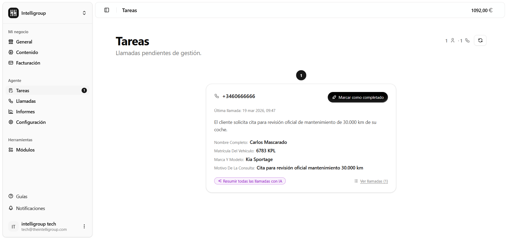
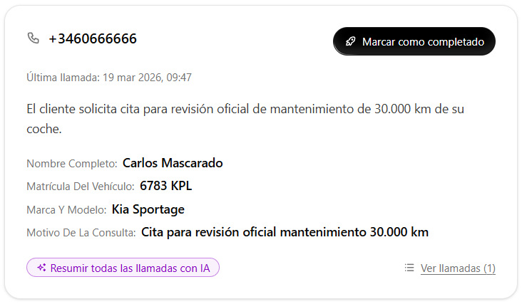

Aquí se agrupan las llamadas que están pendientes de gestión. El objetivo es que tengas en un solo lugar todas las interacciones que requieren una acción por tu parte, sin tener que revisar el listado completo de llamadas.

---

## Vista de tarjetas

Cada tarea se muestra como una tarjeta con la siguiente información:

- **Teléfono** del llamante.
- **Fecha y hora** de la última llamada.
- **Resumen** automático generado por la IA sobre el motivo de la llamada.
- **Datos recopilados** durante la llamada (nombre, matrícula, motivo de consulta, etc.), según los campos configurados en tu agente.

---

## Acciones disponibles

Desde cada tarjeta puedes: 

- **Marcar como completado** -- indica que ya has gestionado esa tarea.
- **Resumir todas las llamadas con IA** -- genera un resumen conjunto de todas las llamadas de ese contacto.
- **Ver llamadas** -- accede al historial completo de ese número.

--- 

## Contador de tareas pendientes

En el menú lateral, la sección **Tareas** muestra un badge con el número de tareas pendientes para que lo tengas siempre visible.