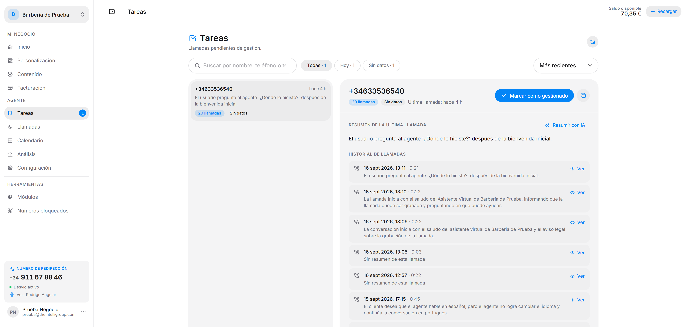

Aquí se agrupan las llamadas pendientes de gestión, **por contacto**. En vez de recorrer el listado completo de llamadas, tienes en un solo sitio a quién tienes que devolver la llamada y por qué.

La pantalla se divide en dos: la **lista de contactos** a la izquierda y el **detalle** del que selecciones a la derecha.

---

## Buscar y filtrar

Sobre la lista tienes:

- **Buscador** por nombre, teléfono o texto.
- **Filtros rápidos** con su contador: **Todas**, **Hoy** y **Sin datos** (contactos de los que el agente no llegó a recoger ningún dato).
- **Orden**, por defecto *Más recientes*.

---

## Detalle del contacto

Al seleccionar un contacto de la lista, a la derecha aparece:

- **Teléfono**, número de llamadas acumuladas y cuándo fue la última.
- **Resumen de la última llamada**, con el botón **Resumir con IA** para regenerarlo.
- **Historial de llamadas** — todas las llamadas de ese número con su fecha, duración y resumen. El enlace **Ver** de cada una abre su detalle completo.
- **Marcar como gestionado** — cierra la tarea. El contacto desaparece de Tareas y sus llamadas pasan a estado *Gestionado*.

---

## Contador de pendientes

En el menú lateral, **Tareas** lleva un badge con el número de tareas pendientes, para que lo tengas siempre a la vista sin entrar.

:::note
Una tarea es un **contacto**, no una llamada. Si el mismo número ha llamado cinco veces, verás una sola tarea con las cinco llamadas dentro.
:::
