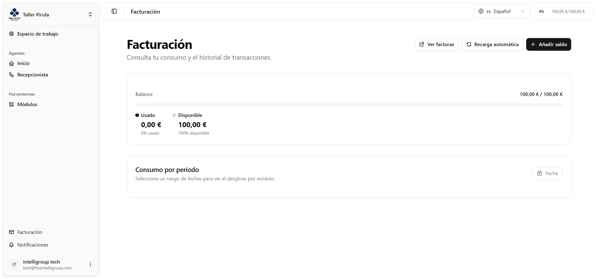
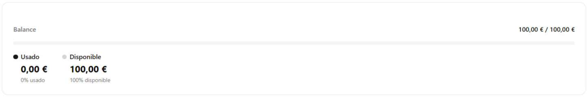
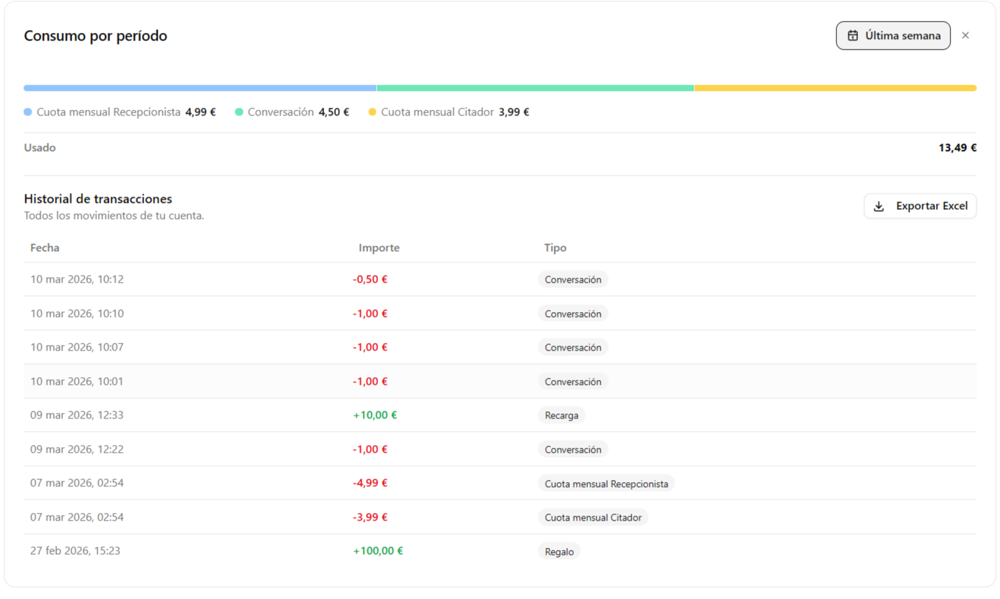
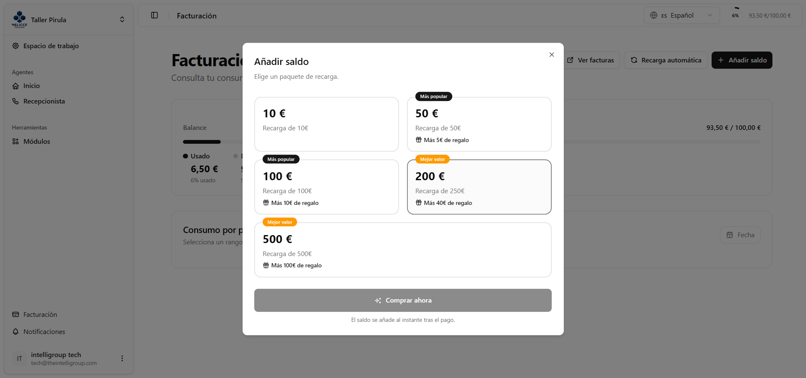
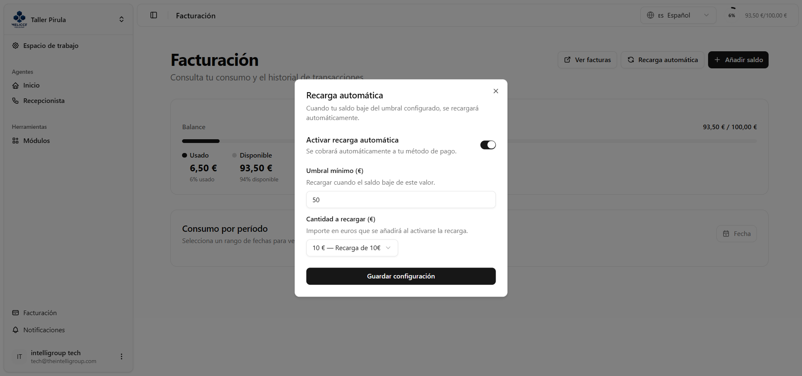

Aquí puedes controlar tu saldo, comprar recargas y revisar todo lo que ha entrado y salido de tu cuenta. En la esquina superior derecha tienes tres acciones rápidas:

- **Ver facturas** — te lleva al portal de Stripe en una nueva pestaña, donde puedes descargar tus facturas y actualizar tu método de pago cuando quieras.
- **Recarga automática** — abre la configuración para que tu saldo se recargue solo, sin que tengas que estar pendiente.
- **Añadir saldo** — abre el catálogo de paquetes para que elijas el que mejor te venga.

---

## Tu saldo actual

Una tarjeta te muestra de un vistazo cómo está tu saldo:

- Una **barra de progreso** que te indica visualmente cuánto has consumido del total que has comprado hasta ahora.
- **Saldo usado:** lo que llevas gastado en euros y qué porcentaje representa.
- **Saldo disponible:** lo que te queda, también con su porcentaje.

---

## ¿Cuánto has gastado en un período?

Elige un rango de fechas y verás aparecer de forma animada un desglose detallado de tus gastos:

- Una **barra de uso por módulo**: una barra horizontal dividida en bloques de colores, uno por cada tipo de gasto (conversaciones del Recepcionista, cuota mensual, recargas, regalos, etc.). Si pasas el cursor por encima de cada bloque, verás el concepto y su importe exacto.
- Una **leyenda** debajo de la barra con el nombre de cada concepto y lo que has gastado en él.
- El **total gastado** en el período que hayas seleccionado.

Justo debajo del desglose encontrarás el **historial de transacciones** de ese período:

- Una tabla con la fecha, el importe — en verde si es una recarga o un regalo, en rojo si es un consumo — y el tipo de movimiento con una etiqueta identificativa.
- Si tienes más de 10 registros, aparecen botones de paginación para moverte entre páginas, con el indicador "Página X de Y" para que no te pierdas.
- Un botón **Exportar Excel** por si quieres llevarte todos los movimientos a un archivo `.xlsx`.

---

## Añadir saldo

Al pulsar "Añadir saldo" se abre una ventana con todos los paquetes de recarga disponibles. Cada paquete te muestra:

- Su **precio en euros**.
- El **nombre del paquete**.
- Si incluye **euros de regalo**, lo verás indicado con un icono de regalo.
- Los paquetes más populares o los que ofrecen mejor valor llevan una **etiqueta especial** bien visible encima.

Cuando eliges un paquete, el botón de confirmación te muestra el importe exacto antes de que hagas nada — así puedes revisar bien lo que vas a pagar. Si lo confirmas, el pago se procesa al momento y tu saldo se actualiza enseguida.

---

## Recarga automática

Si no quieres quedarte sin saldo por sorpresa, aquí puedes configurar que todo se gestione solo:

- Un **interruptor** para activar o desactivar la función.
- **Umbral mínimo en euros**: cuando tu saldo disponible baje de esta cantidad, se disparará la recarga automáticamente.
- **Paquete de recarga**: elige qué paquete quieres que se compre cada vez que se active la recarga.
- Un botón **Guardar configuración** para que los cambios queden guardados.

Mientras la recarga automática esté desactivada, los campos de umbral y paquete aparecen en gris y no se pueden editar.

