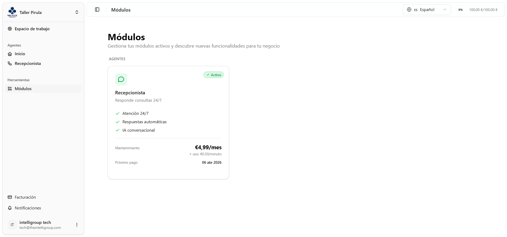

Aquí puedes ver y gestionar los módulos (agentes de IA) disponibles en tu espacio de trabajo. Puedes activar o desactivar cada uno según lo que necesites.

---

## Cómo está organizado

Verás una cuadrícula de tarjetas, una por cada módulo disponible. Cada tarjeta te muestra:

- **Nombre e icono** del módulo.
- **Para qué sirve** — una descripción corta.
- **Qué incluye** — las principales características.
- **Precio** — cuota mensual de mantenimiento y coste por uso (por minuto, por cita, etc.).
- **Próximo pago** — si el módulo está activo, la fecha del siguiente cobro.
- **Estado** — un badge en la esquina que indica si está **Activo** (verde) o **Desactivado** (rojo).

---

## Módulo disponible actualmente

### Recepcionista

El módulo base del producto. Contesta las llamadas entrantes de forma automática, 24/7.

- **Mantenimiento:** €4,99/mes
- **Uso:** €0,50/minuto
- **Incluye:** Atención 24/7, respuestas automáticas e IA conversacional.

:::note
El Recepcionista no se puede desactivar desde esta pantalla — es el módulo esencial de IntelliVoice.
:::

---

{/* ## Activar un módulo

Al pulsar **"Activar módulo"** en una tarjeta desactivada, aparece un diálogo que te indica exactamente cuánto se va a cobrar: la cuota mensual más el coste por uso. Confirma para activarlo. La activación es inmediata y recibirás una notificación de éxito o error.

---

## Desactivar un módulo

Al pulsar **"Desactivar"**, el comportamiento depende de cuándo vence el período pagado:

- **Si el período aún no ha vencido** — se desactiva directamente sin pedir confirmación. Ya está pagado hasta esa fecha, así que puedes seguir usándolo hasta entonces.
- **Si el período ya venció** — aparece un aviso indicando que perderás el acceso de inmediato. Deberás confirmarlo para continuar.

En ambos casos la desactivación es inmediata y recibirás una notificación. */}
