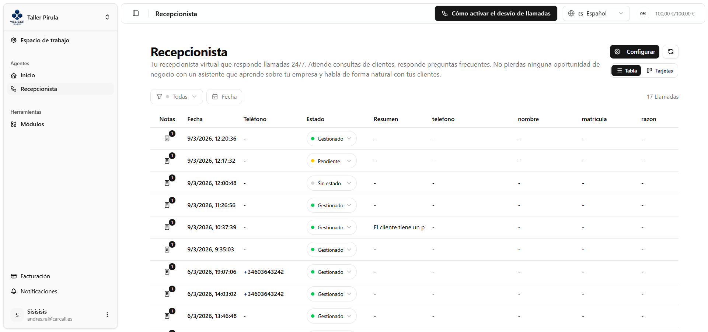
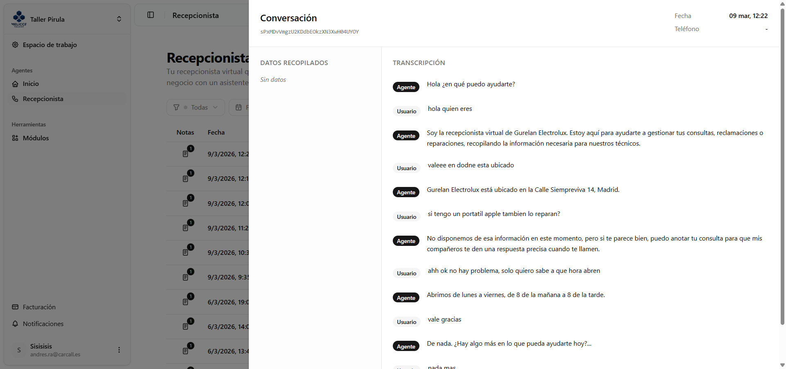
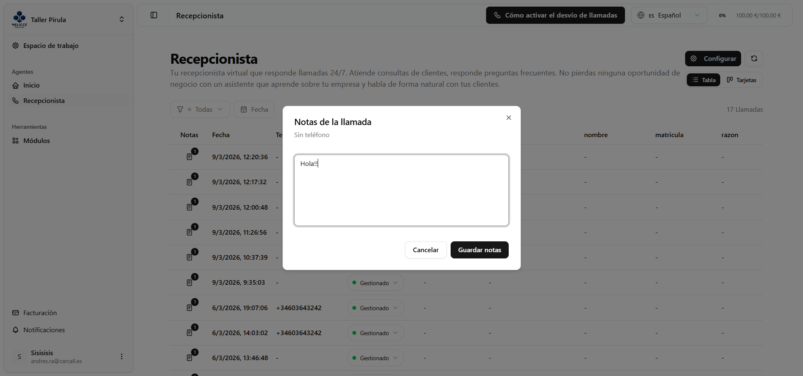
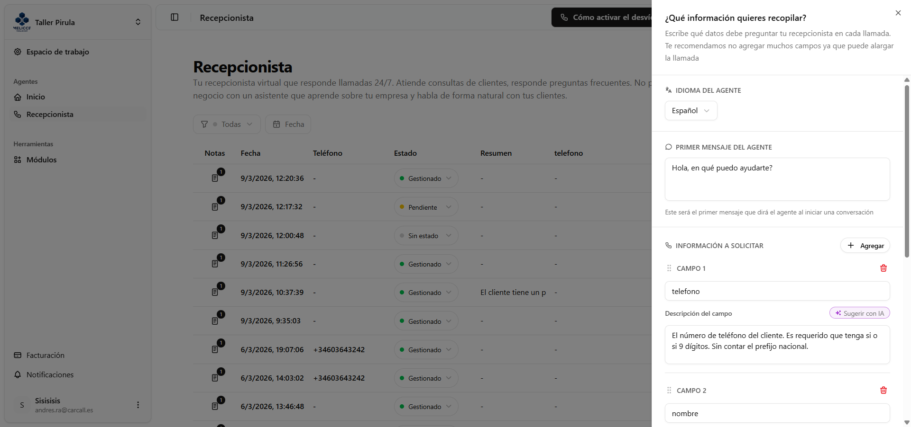

## ¿Qué es?

El **Recepcionista** es un agente de voz virtual que atiende llamadas telefónicas entrantes de forma automática, las 24 horas del día, los 7 días de la semana. Cuando alguien llama al número del negocio, la IA contesta, mantiene una conversación natural con el cliente, recopila la información configurada (nombre, motivo de la llamada, etc.) y genera un resumen de cada conversación. Desde el panel web puedes revisar todas las llamadas y gestionarlas.

---

## Pantalla principal — vista de llamadas

Al entrar al módulo verás un listado con todas las llamadas recibidas. Puedes elegir entre dos formas de visualizarlo:

- **Vista Tabla** — filas con columnas: fecha, teléfono, estado, resumen y los campos de datos configurados.
- **Vista Tarjetas** — cada llamada como una tarjeta individual.

Cambia entre ambas vistas con los botones **Tabla / Tarjetas** en la esquina superior derecha. La preferencia se guarda y se recuerda la próxima vez.

---

## Filtros

En la barra superior de la lista encontrarás los siguientes controles:

| Control | Descripción |
|---|---|
| **Filtro de estado** | Muestra Todas, Sin estado, Pendientes o Gestionadas. |
| **Rango de fechas** | Filtra las llamadas entre una fecha de inicio y una fecha de fin. |
| **Limpiar filtros** | Aparece solo cuando hay un filtro de estado activo; lo resetea. |
| **Contador** | A la derecha de los filtros, indica cuántas llamadas hay con los filtros aplicados. |

---

## Carga y refresco

No tienes que preocuparte por perder ninguna llamada. La pantalla está pensada para mantenerse siempre al día:

- **¿Tienes muchas llamadas?** Simplemente baja hasta el final de la lista y se cargarán más solas.
- **¿No quieres estar pendiente?** Cada 30 segundos la pantalla se actualiza automáticamente en segundo plano.
- **¿Quieres ver los cambios ahora mismo?** Pulsa el icono de flechas circulares en la parte superior y se refresca al instante.

---

## Acciones por llamada

### Ver el detalle

Haz clic en cualquier fila o tarjeta para abrir un panel lateral a la derecha con:

- **Fecha y teléfono** del llamante.
- **Datos recopilados** — los campos que el agente preguntó durante la llamada.
- **Resumen** — texto breve generado automáticamente sobre de qué trató la llamada.
- **Transcripción completa** — todo lo que se dijo, turno a turno, indicando si habló el **Agente** o el **Usuario** y el tiempo dentro de la llamada en que ocurrió cada mensaje.

### Cambiar el estado

Cada llamada tiene un selector de estado con tres opciones. Puedes cambiarlo directamente desde la tabla o las tarjetas sin necesidad de abrir el detalle. Al cambiar se guarda al momento y aparece una notificación de éxito o error.

| Estado | Indicador |
|---|---|
| **Sin estado** | Punto gris |
| **Pendiente** | Punto amarillo |
| **Gestionado** | Punto verde |

### Añadir o editar notas

Cada llamada tiene un botón de notas (icono de libreta). Al pulsarlo se abre un cuadro de diálogo con un campo de texto libre para escribir notas internas. Si la llamada ya tiene notas, el icono aparece destacado en color primario con una pequeña insignia. Al guardar se confirma con una notificación.

---

## Configuración del Recepcionista

El botón **Configurar** en la parte superior abre el panel de configuración del agente.

### Idioma

Elige el idioma principal que usará el agente al contestar las llamadas.

### Mensaje de bienvenida

Escribe el primer mensaje que dirá el agente al contestar. Por ejemplo: *"Hola, gracias por llamar a…"*.

### Campos de datos a recopilar

Define qué información debe preguntar el agente durante la llamada. Cada campo tiene:

- **Nombre del campo** — el dato que se quiere obtener (ej: *"Nombre completo"*, *"Motivo de la consulta"*).
- **Descripción del campo** — contexto adicional para que la IA entienda cómo pedir ese dato.
- **Sugerir con IA** — introduce el nombre del campo y se genera automáticamente una descripción sugerida.

Puedes gestionar los campos de la siguiente manera:

- **Agregar** — botón "Agregar" para añadir un campo nuevo.
- **Reordenar** — arrastra los campos con el icono de arrastre a la izquierda de cada uno.
- **Eliminar** — icono de papelera; primero los marca en rojo para confirmar, y puedes restaurarlos antes de guardar.

:::caution
Los cambios en los campos solo afectan a las **llamadas nuevas**. Las llamadas anteriores conservan los datos que se recopilaron con la configuración activa en ese momento.
:::

Al terminar usa los botones **Cancelar** (descarta los cambios) o **Guardar** (aplica los cambios).

