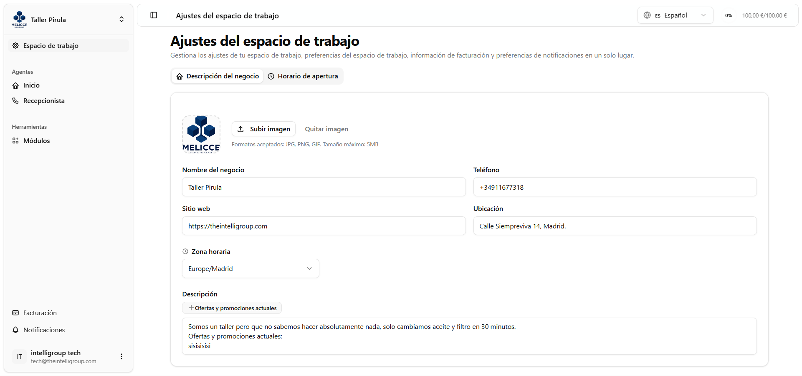
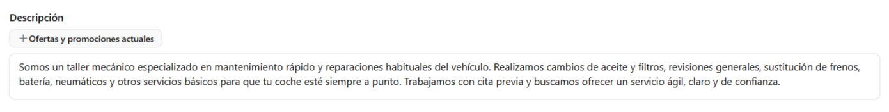
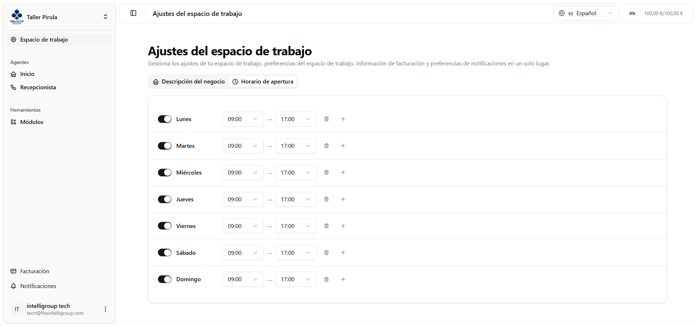

Es la pantalla donde configuras toda la información de tu negocio. El agente de voz usa estos datos para contestar las llamadas correctamente. Se divide en dos pestañas.

---

## Pestaña 1 — Descripción del negocio

Aquí defines los datos generales que el agente conoce sobre tu negocio.

| Campo | Descripción |
|---|---|
| **Logo** | Sube una imagen (JPG, PNG o GIF, máximo 5 MB). Se muestra una previsualización al instante y puedes eliminar el logo en cualquier momento. |
| **Nombre del negocio** | Cómo se llama tu negocio. |
| **Teléfono** | Número de contacto del negocio. |
| **Sitio web** | URL del negocio. |
| **Ubicación** | Dirección o ciudad del negocio. |
| **Zona horaria** | Se selecciona desde un buscador con todas las zonas horarias del mundo. |
| **Descripción** | Campo de texto libre donde escribes todo lo que el agente debe saber — servicios, productos, instrucciones, etc. |

:::tip
La **descripción** es el campo más importante. Cuanto más detallada sea, mejor contestará el agente las preguntas de tus clientes. Usa el botón de atajo para insertar rápidamente el apartado de **ofertas y promociones actuales**.
:::

---

## Pestaña 2 — Horario de apertura

Define en qué días y a qué horas está disponible tu negocio. Hay una fila por cada día de la semana, de lunes a domingo.

En cada fila puedes:

- **Activar o desactivar el día** con el interruptor. Si está desactivado, aparece como _"No disponible"_.
- **Configurar los turnos** cuando el día está activo: hora de apertura y hora de cierre en intervalos de 30 minutos.
- **Añadir varios turnos** por día (por ejemplo, mañana y tarde) con el botón **+**.
- **Eliminar un turno** individualmente con el icono de papelera.

---

## Barra de guardado

Cuando tienes cambios sin guardar en cualquiera de las dos pestañas, aparece una barra fija en la parte inferior de la pantalla con un **punto naranja parpadeante** que te avisa de que hay cambios pendientes.

Desde ahí tienes dos opciones:

- **Descartar cambios** — deshace todo y vuelve al estado guardado.
- **Guardar cambios** — guarda todo (incluyendo el logo) y confirma con una notificación. La barra desaparece automáticamente al guardar.
