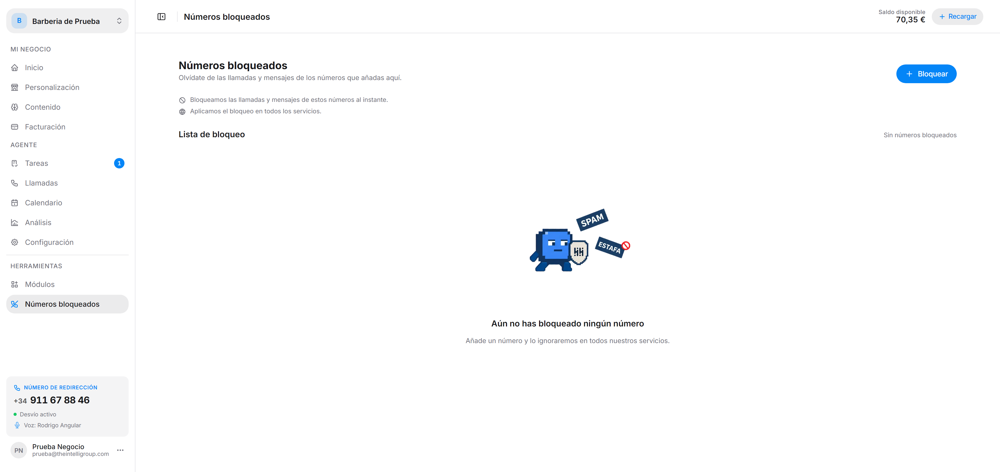

Olvídate de las llamadas y mensajes de los números que añadas aquí.

---

## Cómo funciona

- Las llamadas y mensajes de estos números se bloquean **al instante**.
- El bloqueo se aplica en **todos los servicios**, no solo en el Recepcionista.

---

## Bloquear un número

Con el botón **+ Bloquear** de la esquina superior derecha añades un número. Puedes acompañarlo de un **motivo**, que se guarda como etiqueta junto al número. Hay atajos para los habituales:

- Spam comercial
- Acoso
- Llamadas reiteradas
- Broma o equivocación
- Otro

También puedes bloquear desde una llamada concreta: ábrela en [Llamadas](/intellivoice/agent/calls) y pulsa **Bloquear llamadas** al final del panel de detalle.

---

## Lista de bloqueo

Cada entrada muestra el número, su motivo como etiqueta de color y la fecha en que se bloqueó. Mientras no tengas ninguno, verás *Aún no has bloqueado ningún número*.

Para quitar uno, usa **Desbloquear**: las próximas llamadas desde ese número volverán a llegar a tu agente.

:::tip
Si en [Análisis](/intellivoice/agent/analysis) se te acumulan llamadas en el tramo de `0-15s`, suelen ser cuelgues o spam. Mira de qué números vienen y bloquéalos.
:::
