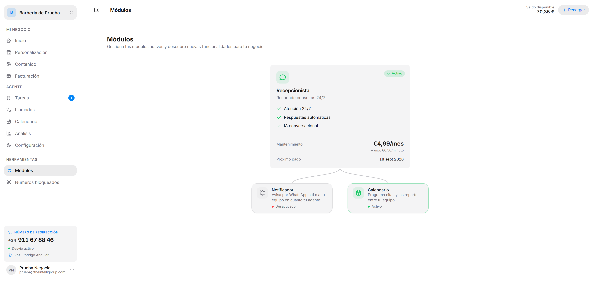

Gestiona tus módulos activos y descubre nuevas funcionalidades para tu negocio.

Los módulos se muestran como un árbol: el **Recepcionista** arriba, y colgando de él los complementos que lo amplían. Cada tarjeta indica su **estado** con un badge — *Activo* o *Desactivado* — y, si está activo, la fecha del **próximo pago**.

---

## Recepcionista

El módulo base. Responde consultas 24/7.

- **Mantenimiento:** €4,99/mes
- **Uso:** €0,50/minuto
- **Incluye:** atención 24/7, respuestas automáticas, IA conversacional y múltiples canales.

:::note
El Recepcionista es el módulo esencial de IntelliVoice: su tarjeta no tiene botón de activar ni desactivar.
:::

---

## Calendario

Programa citas y las reparte entre tu equipo.

- **Mantenimiento:** €3,99/mes (sin coste por uso)
- **Incluye:** un calendario por cada persona, sala o equipo; el agente agenda en directo mientras habla con el cliente; cada calendario con su horario, sus ausencias y sus límites; el día repartido en columnas para mover una cita de uno a otro; confirmación manual o automática.

Al activarlo aparecen en el menú la sección [Calendario](/intellivoice/agent/calendar) y la pestaña **Calendario** de [Configuración](/intellivoice/agent/settings).

---

## Notificador

Avisa por WhatsApp a ti o a tu equipo en cuanto tu agente atiende una llamada.

- **Mantenimiento:** €1,99/mes
- **Uso:** €0,05/aviso
- **Incluye:** aviso al instante por WhatsApp, varios destinatarios y control de quién recibe cada aviso.

Se configura en la pestaña **Notificador** de [Configuración](/intellivoice/agent/settings).

---

## Activar y desactivar

El comportamiento depende de si el período que ya has pagado sigue vigente:

- **Dentro del período pagado** — el cambio se aplica directo, sin confirmación. Ya está pagado hasta la fecha del próximo pago.
- **Fuera del período pagado** — aparece un diálogo. Al activar te dice lo que se te va a cobrar (cuota mensual más coste por uso) antes de confirmar; al desactivar te avisa de que perderás el acceso a sus funcionalidades de inmediato.

:::caution
Las cuotas mensuales de los módulos activos se descuentan de tu saldo. Las verás desglosadas en [Facturación](/intellivoice/workspace/billing) como *Cuota mensual Recepcionista*, *Cuota mensual Calendario*, etc.
:::
