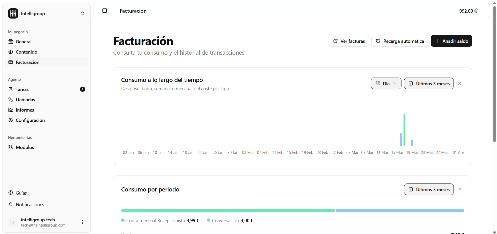
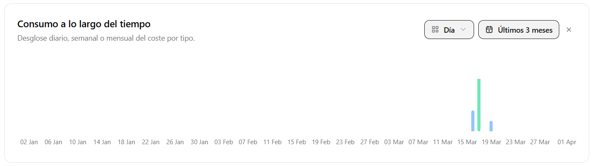
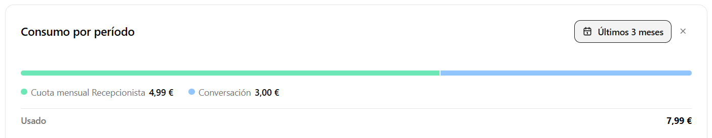
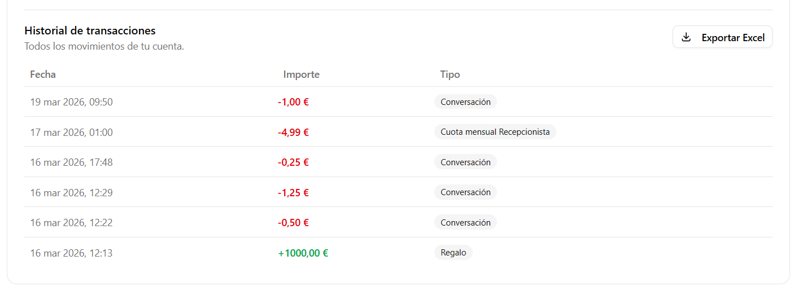
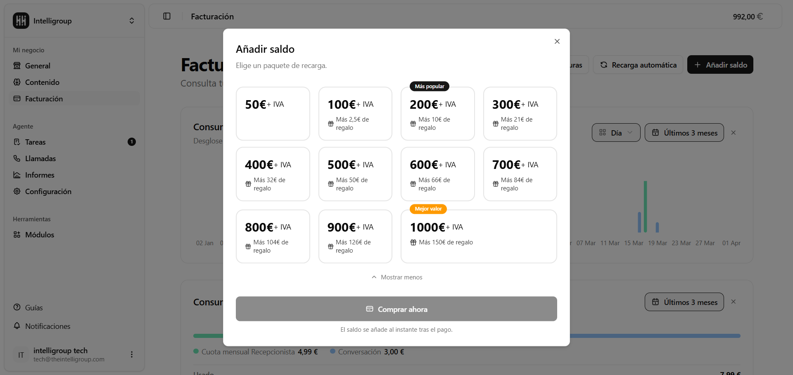
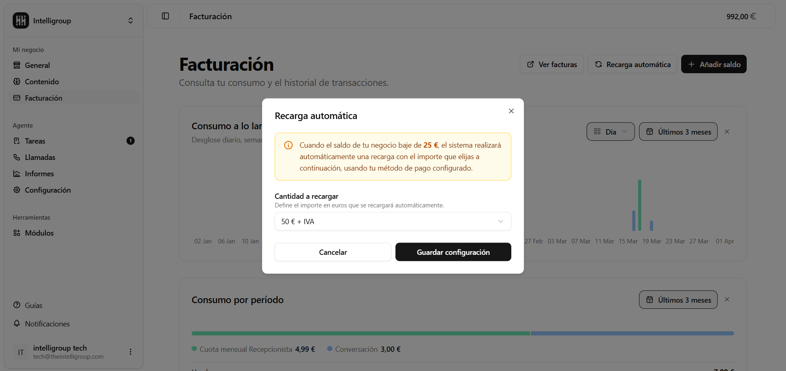

Consulta tu consumo y el historial de transacciones. En la esquina superior derecha tienes tres acciones rápidas:

- **Ver facturas** — te lleva al portal de Stripe en una nueva pestaña, donde puedes descargar tus facturas y actualizar tu método de pago.
- **Recarga automática** — abre la configuración para que tu saldo se recargue solo.
- **+ Añadir saldo** — abre el catálogo de paquetes de recarga.

---

## Consumo a lo largo del tiempo

Gráfica de barras que muestra el desglose diario, semanal o mensual del coste por tipo. Puedes ajustar la granularidad con el selector **Día / Semana / Mes** y elegir el período con el selector de fechas.

---

## Consumo por período

Elige un rango de fechas y verás un desglose detallado de tus gastos:

- Una **barra de uso por módulo**: dividida en bloques de colores, uno por cada tipo de gasto (cuota mensual del Recepcionista, conversaciones, recargas, etc.). Pasa el cursor por encima de cada bloque para ver el concepto y su importe exacto.
- Una **leyenda** con el nombre de cada concepto y lo que has gastado en él.
- El **total usado** en el período seleccionado.

---

## Historial de transacciones

Tabla con todos los movimientos del período seleccionado:

- **Fecha** del movimiento.
- **Importe** — en verde si es una recarga o un regalo, en rojo si es un consumo.
- **Tipo** — etiqueta identificativa del concepto (Conversación, Cuota mensual Recepcionista, etc.).

Si tienes más de 10 registros, aparecen botones de paginación para moverte entre páginas.

Usa el botón **Exportar Excel** para descargarte todos los movimientos en un archivo `.xlsx`.

---

## Añadir saldo

Al pulsar **+ Añadir saldo** se abre una ventana con todos los paquetes de recarga disponibles. Cada paquete muestra:

- Su **precio en euros**.
- El **nombre del paquete**.
- Si incluye **euros de regalo**, aparece indicado con un icono de regalo.
- Los paquetes más populares o con mejor valor llevan una **etiqueta especial** visible.

Cuando eliges un paquete, el botón de confirmación te muestra el importe exacto antes de confirmar. El pago se procesa al momento y el saldo se actualiza enseguida.

---

## Recarga automática

Si no quieres quedarte sin saldo por sorpresa, configura la recarga automática:

- Un **interruptor** para activar o desactivar la función.
- **Umbral mínimo en euros** — cuando tu saldo disponible baje de esta cantidad, se disparará la recarga automáticamente.
- **Paquete de recarga** — elige qué paquete quieres que se compre cada vez.
- Botón **Guardar configuración** para aplicar los cambios.

Mientras la recarga automática esté desactivada, los campos aparecen en gris y no se pueden editar.