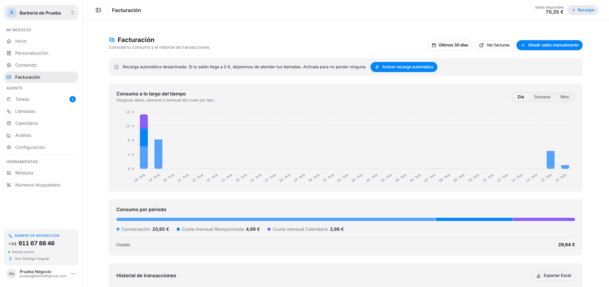
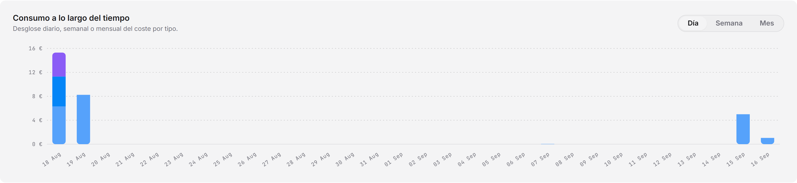
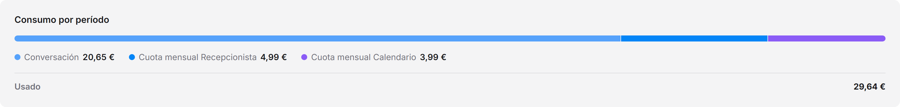
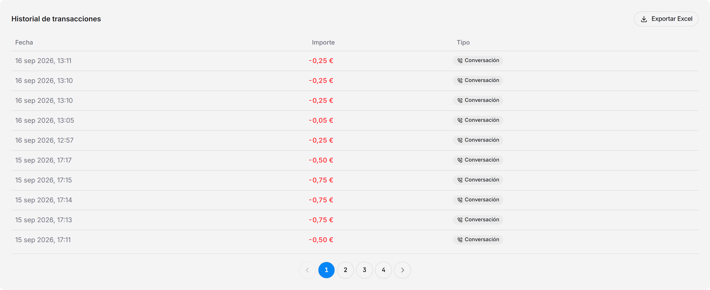
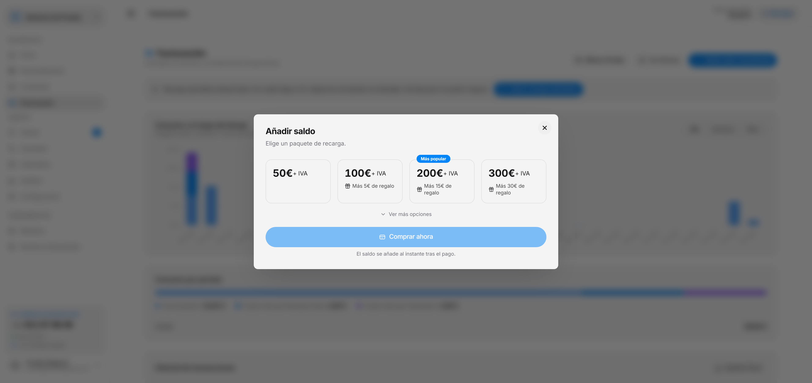
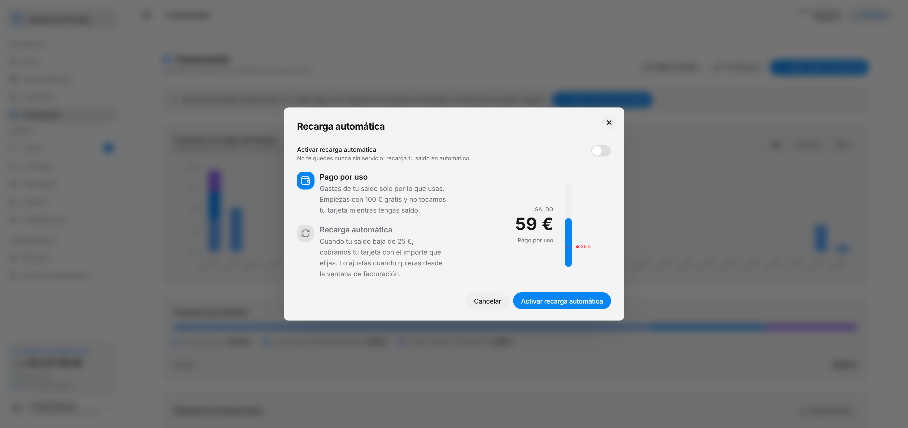

Consulta tu consumo y el historial de transacciones. En la esquina superior derecha tienes el selector de período y tres acciones:

- **Últimos 30 días** — el rango de fechas que se aplica a toda la pantalla.
- **Ver facturas** — abre el portal de Stripe en una pestaña nueva, donde descargas tus facturas y actualizas el método de pago.
- **+ Añadir saldo manualmente** — abre el catálogo de paquetes de recarga.

:::caution
Si la recarga automática está desactivada, aparece un aviso en la parte superior: cuando el saldo llega a 0 € el agente **deja de atender llamadas**. El botón **Activar recarga automática** del propio aviso la configura.
:::

---

## Consumo a lo largo del tiempo

Gráfica de barras con el coste por tipo. Cambia la granularidad con el selector **Día / Semana / Mes**; cada barra se divide en colores según el concepto (conversaciones, cuotas de módulo, etc.).

---

## Consumo por período

El desglose del período seleccionado:

- Una **barra de uso** dividida en bloques de color, uno por concepto. Pasa el cursor por encima para ver el importe exacto.
- Una **leyenda** con cada concepto y lo gastado en él — por ejemplo *Conversación*, *Cuota mensual Recepcionista* o *Cuota mensual Calendario*.
- El **total usado** en el período.

---

## Historial de transacciones

Tabla con todos los movimientos del período:

- **Fecha** del movimiento.
- **Importe** — en verde lo que entra, en rojo lo que se consume y en amarillo lo que está **pendiente**.
- **Tipo** — etiqueta del concepto.

Si los movimientos no caben en una página aparecen los controles de paginación. El botón **Exportar Excel** te descarga todos los movimientos en un `.xlsx`.

---

## Añadir saldo

Al pulsar **+ Añadir saldo manualmente** se abre el catálogo de paquetes. Cada uno muestra el **precio + IVA** y, si lo lleva, los **euros de regalo** que se suman a la recarga. El paquete recomendado va marcado como **Más popular**, y el enlace **Ver más opciones** despliega el resto.

Al elegir un paquete, el botón **Comprar ahora** confirma la compra. El pago se procesa al momento y el saldo se actualiza enseguida.

---

## Recarga automática

Para no quedarte sin saldo por sorpresa:

- Un **interruptor** para activarla o desactivarla.
- **Umbral mínimo en euros** — cuando el saldo baje de esta cantidad, se dispara la recarga.
- **Paquete de recarga** — cuál se compra cada vez que salta.
- Botón **Guardar configuración**.

Mientras esté desactivada, los campos de umbral y paquete aparecen en gris y no se pueden editar.
