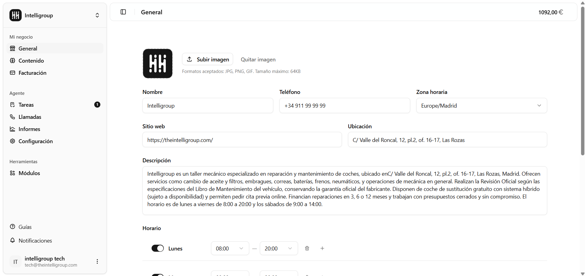
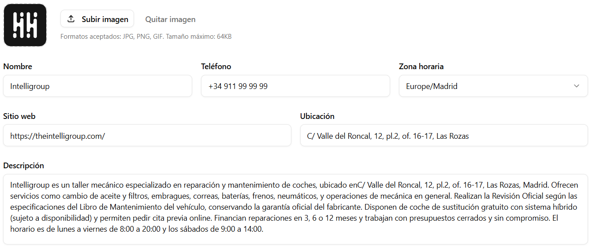
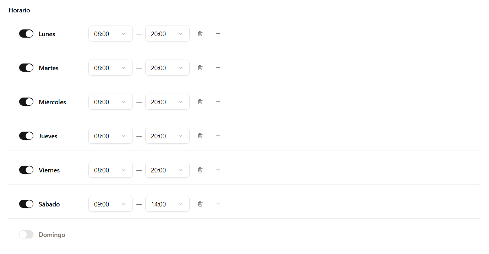

Es la pantalla donde configuras toda la información de tu negocio. El agente de voz usa estos datos para contestar las llamadas correctamente.

---

## Logo

Sube una imagen en formato JPG, PNG o GIF con un tamaño máximo de 64 KB. Se muestra una previsualización al instante y puedes eliminar el logo en cualquier momento con el botón Quitar imagen.

---

## Datos del negocio

| Campo | Descripción |
| --- | --- |
| **Nombre** | Cómo se llama tu negocio. |
| **Teléfono** | Número de contacto del negocio. |
| **Zona horaria** | Se selecciona desde un desplegable. Ejemplo: `Europe/Madrid`. |
| **Sitio web** | URL del negocio. |
| **Ubicación** | Dirección o ciudad del negocio. |
| **Descripción** | Campo de texto libre donde escribes todo lo que el agente debe saber — servicios, productos, instrucciones, etc. |

:::tip
La **descripción** es el campo más importante. Cuanto más detallada sea, mejor contestará el agente las preguntas de tus clientes.
:::

---

## Horario

Define en qué días y a qué horas está disponible tu negocio. Hay una fila por cada día de la semana, de lunes a domingo.

En cada fila puedes:
- **Activar o desactivar el día** con el interruptor. Si está desactivado, aparece como "No disponible".
- **Configurar los turnos** cuando el día está activo: hora de apertura y hora de cierre en intervalos de 30 minutos.
- **Añadir varios turnos** por día (por ejemplo, mañana y tarde) con el botón +.
- **Eliminar un turno** individualmente con el icono de papelera.

---

## Guardar cambios

Cuando termines de editar, usa el botón **Guardar** para aplicar los cambios. Si quieres descartar todo lo que has modificado, usa **Cancelar**.