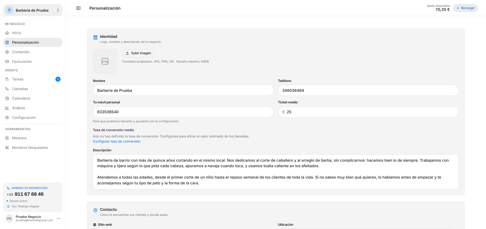
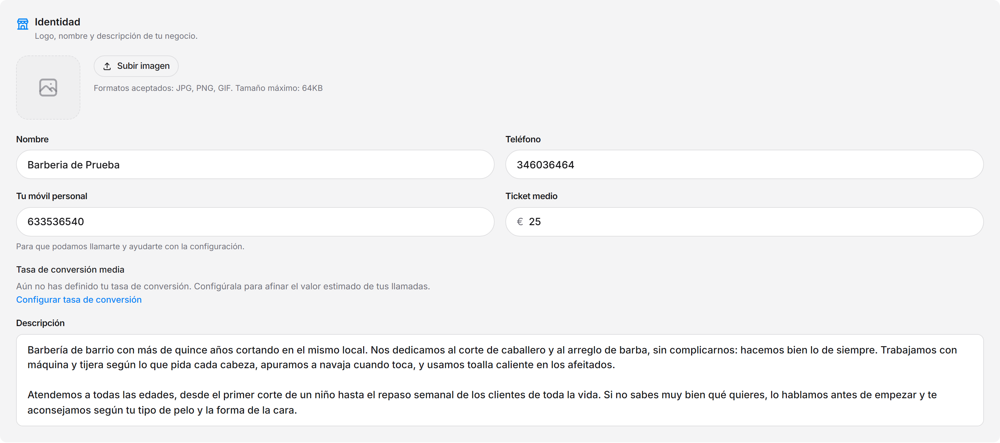
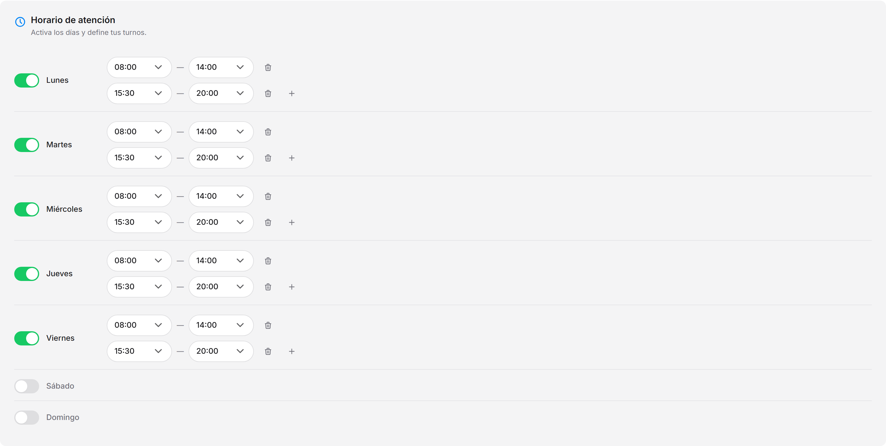

Es la pantalla donde defines la información de tu negocio. El agente de voz usa estos datos para contestar las llamadas correctamente. Está dividida en tres bloques: **Identidad**, **Contacto** y **Horario de atención**.

---

## Identidad

Logo, nombre y descripción de tu negocio.

| Campo | Descripción |
|---|---|
| **Logo** | Botón **Subir imagen**. Formatos JPG, PNG o GIF, con un tamaño máximo de **64 KB**. Se previsualiza al instante. |
| **Nombre** | Cómo se llama tu negocio. Es el nombre que dice el agente al contestar. |
| **Teléfono** | Número de contacto público del negocio. |
| **Tu móvil personal** | Tu número, para que podamos llamarte y ayudarte con la configuración. |
| **Ticket medio** | Lo que gasta de media un cliente. Se usa para estimar el **valor de tus llamadas** en [Inicio](/intellivoice/workspace/inicio). |
| **Tasa de conversión media** | Qué porcentaje de llamadas acaba en venta. Si no la has definido, aparece el enlace **Configurar tasa de conversión**. |
| **Descripción** | Texto libre con todo lo que el agente debe saber — a qué os dedicáis, cómo trabajáis, instrucciones. |

:::tip
La **descripción** es el campo más importante: cuanto más detallada, mejor contesta el agente. Para preguntas concretas, precios y servicios es mejor usar [Contenido](/intellivoice/workspace/knowledge), que está estructurado y el agente lo consulta mejor.
:::

---

## Contacto

Cómo te encuentran tus clientes y dónde estás.

| Campo | Descripción |
|---|---|
| **Sitio web** | URL del negocio. |
| **Ubicación** | Dirección o ciudad. |
| **Zona horaria** | Se elige de un desplegable. Ejemplo: `Europe/Madrid`. Determina a qué hora se aplica tu horario. |

---

## Horario de atención

Activa los días que abres y define tus turnos. Hay una fila por cada día de la semana.

En cada fila puedes:

- **Activar o desactivar el día** con el interruptor. Los días desactivados quedan sin turnos.
- **Configurar el turno**: hora de apertura y hora de cierre en intervalos de 30 minutos.
- **Añadir varios turnos** por día — por ejemplo mañana y tarde — con el botón **+**.
- **Eliminar un turno** con el icono de papelera.

:::note
Este horario es el del negocio. Las llamadas que entran fuera de él las sigue atendiendo el agente, y las verás contadas en la tarjeta **Fuera de horario** de Inicio. El horario en el que se pueden **agendar citas** se configura aparte, en [Configuración → Calendario](/intellivoice/agent/settings).
:::
