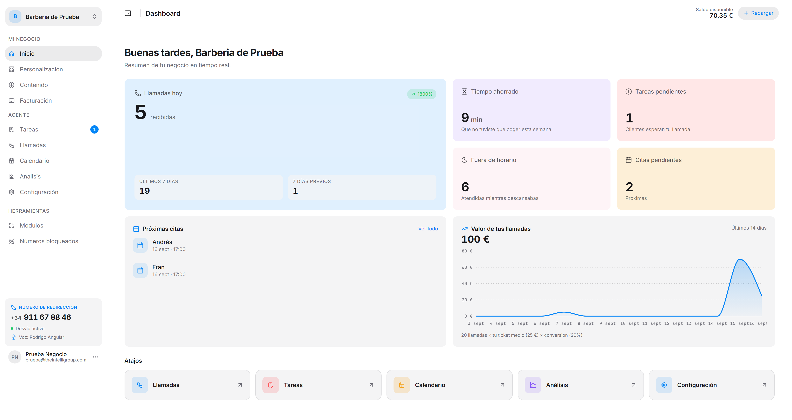
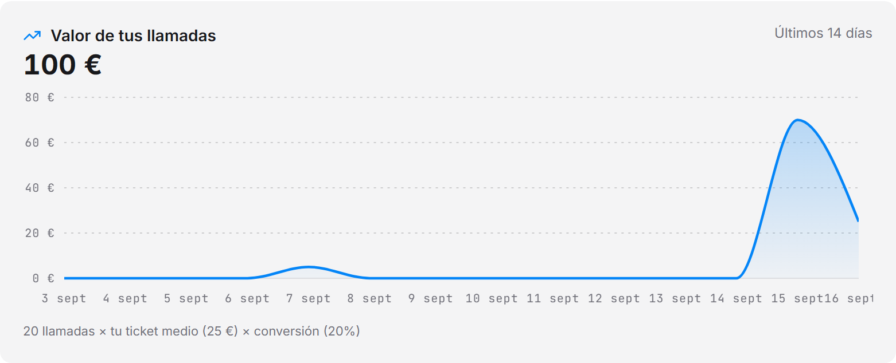

Es lo primero que ves al entrar al panel. De un vistazo tienes cómo va el día: cuántas llamadas han entrado, cuánto tiempo te has ahorrado y qué te queda por gestionar.



---

## Tarjetas de resumen

| Tarjeta | Qué te dice |
|---|---|
| **Llamadas hoy** | Las llamadas recibidas hoy, con el porcentaje de subida o bajada respecto a la semana anterior. Debajo, el total de los **últimos 7 días** y el de los **7 días previos** para que compares. |
| **Tiempo ahorrado** | El tiempo total de las llamadas de los últimos 7 días: lo que no has tenido que atender tú. |
| **Tareas pendientes** | Cuántos clientes esperan que les devuelvas la llamada. |
| **Fuera de horario** | Llamadas de los últimos 7 días que entraron fuera del horario de atención que tienes en [Personalización](/intellivoice/workspace/general). |
| **Citas pendientes** | Próximas citas agendadas, si tienes el módulo Calendario activo. |

---

## Próximas citas

Lista las citas más próximas de tu agenda. El enlace **Ver todo** te lleva al [Calendario](/intellivoice/agent/calendar) completo. Si no tienes ninguna por delante, la tarjeta muestra *Sin citas próximas*.

---

## Valor de tus llamadas

Una gráfica de los últimos 14 días que estima en euros lo que valen las llamadas que ha atendido el agente. El cálculo aparece escrito debajo de la gráfica:

```
llamadas × ticket medio × tasa de conversión
```

Los dos últimos valores los defines tú en [Personalización](/intellivoice/workspace/general). Si no has configurado la **tasa de conversión**, la estimación usa un **20 %** por defecto — configúrala para que el número se ajuste a tu negocio. Y si no has puesto ticket medio, la gráfica muestra el número de llamadas en vez de euros.



---

## Atajos

Al final de la pantalla hay accesos directos a Llamadas, Tareas, Calendario, Análisis y Configuración, para saltar a lo que uses más sin pasar por el menú.

:::note
Mientras te falte algo por configurar, aparece abajo a la derecha el panel **Termina tu configuración**, con los pasos que quedan: saludo inicial, voz, idioma, desvío de llamadas, un campo a solicitar, una pregunta frecuente, un servicio, un empleado y tu móvil personal. Puedes plegarlo o cerrarlo y seguir a lo tuyo.
:::
