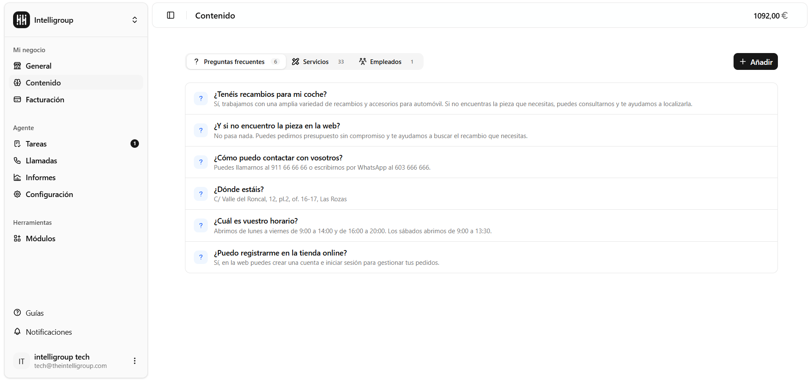
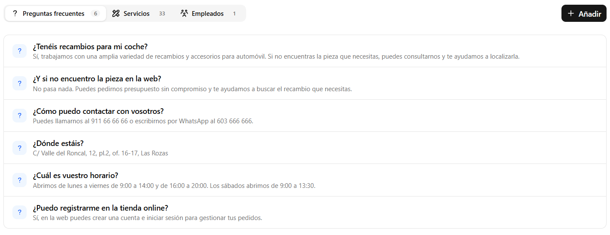
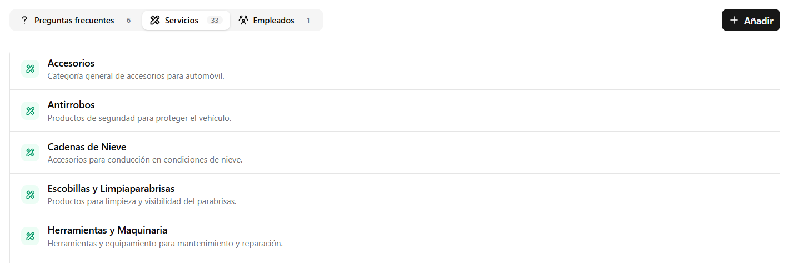
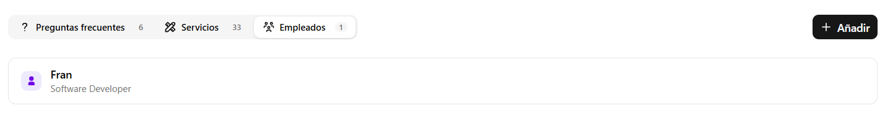

Aquí defines el conocimiento que tiene el agente sobre tu negocio. Está organizado en tres pestañas: **Preguntas frecuentes, Servicios y Empleados**. Usa el botón **+ Añadir** en la esquina superior derecha para agregar entradas en cualquiera de las pestañas.

---

## Preguntas frecuentes

Lista de preguntas y respuestas que el agente puede usar durante las llamadas. Cada entrada muestra la pregunta y su respuesta correspondiente.

Úsalas para responder las dudas más habituales de tus clientes: horarios, ubicación, servicios disponibles, formas de contacto, etc.

---

## Servicios

Catálogo de servicios o productos que ofrece tu negocio. Cada entrada tiene un nombre y una descripción corta. El agente usa esta información para responder preguntas sobre lo que ofreces.

---

## Empleados

Lista de personas del equipo. Cada entrada muestra el nombre del empleado y su cargo o rol dentro del negocio.

