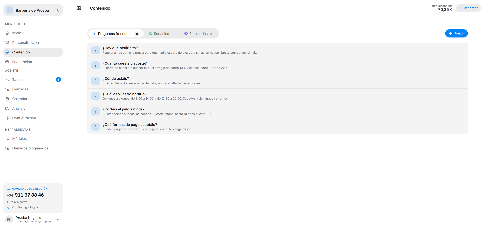
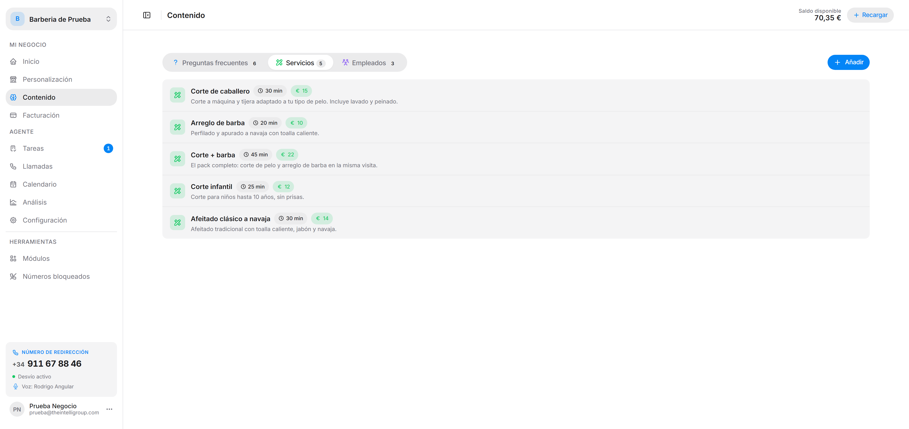
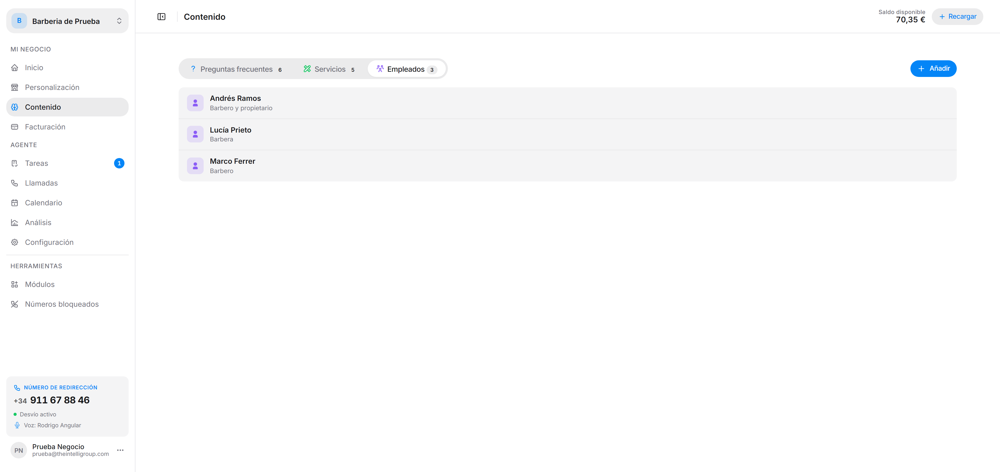

Aquí defines lo que el agente sabe sobre tu negocio. Está organizado en tres pestañas — **Preguntas frecuentes**, **Servicios** y **Empleados** — y cada una lleva al lado un contador con las entradas que tienes. Usa el botón **+ Añadir** de la esquina superior derecha para crear una entrada en la pestaña en la que estés.

Todas las entradas se crean igual: un **Título** y un **Contenido**. Lo que cambia es cómo lo usa el agente.

---

## Preguntas frecuentes

Preguntas y respuestas que el agente usa durante las llamadas. Úsalas para las dudas más habituales: horario, ubicación, formas de pago, si hace falta cita.

Escribe la respuesta tal y como quieres que suene por teléfono — el agente la lee casi literal.

---

## Servicios

El catálogo de lo que ofreces. Cada servicio muestra su **duración** y su **precio** en una etiqueta, además del nombre y la descripción.

La duración es la que usa el módulo [Calendario](/intellivoice/agent/calendar) para calcular cuánto ocupa cada cita en la agenda.

---

## Empleados

Las personas del equipo, con su nombre y su cargo. El agente puede nombrarlas cuando un cliente pregunta por alguien en concreto.

:::tip
Si tienes el Calendario activo, conviene que los nombres coincidan con los de tus calendarios: así el agente puede agendar con la persona que pida el cliente.
:::
